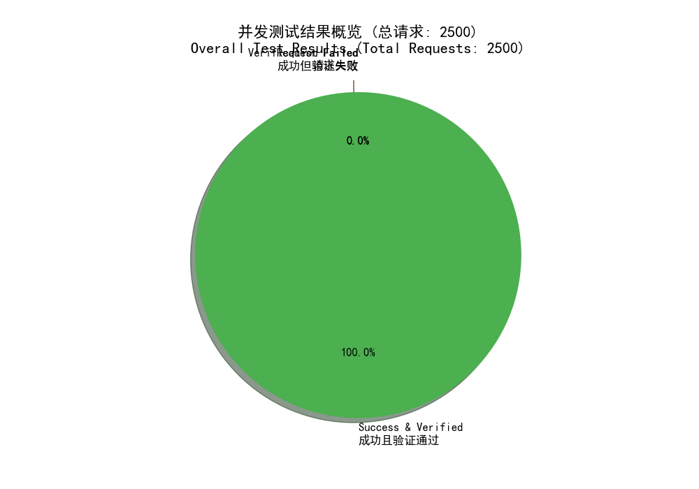
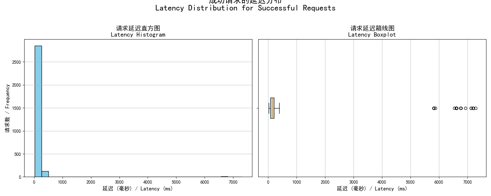

# Code Interpreter API: A Stateful, Secure, and High-Performance Python Sandbox

[中文版](README_zh.md)

This project provides a robust, API-driven Python code execution sandbox, engineered for high security, stateful session management, and strong performance. It utilizes a centralized **API Gateway** and a dynamic **Worker Pool** architecture, providing each user with a completely isolated and persistent Python session.

A key technical feature of this project is its successful implementation of a **"Virtual-Disk-per-Worker"** architecture. This advanced model dynamically creates, formats, and mounts a dedicated virtual disk (`.img` file via `losetup`) for each worker container at runtime. This approach addresses the significant challenge of reliably managing dynamic block devices in a concurrent containerized environment, enabling superior I/O and filesystem isolation that is fundamental to the system's security posture.

Each worker is sandboxed within a multi-layered security model that includes strict resource limits, a zero-trust network policy, and runtime privilege reduction. By leveraging an internal Jupyter Kernel, it maintains the complete code execution context (variables, imports, functions) across multiple API calls, ensuring session continuity, security, and high performance.

## Key Advantages

| Feature | Our Approach | Standard Implementations (Common Trade-offs) |
| :--- | :--- | :--- |
| **🚀 Performance** | A pre-warmed pool of idle workers ensures instant session allocation. The fully asynchronous design (FastAPI, httpx) delivers high throughput (~32.8 RPS) and low latency. | High latency due to on-demand container/environment startup for each new session. Often synchronous, leading to poor concurrency under load. |
| **🔒 Security** | A multi-layered, zero-trust security model: no internet access (`internal: true`), inter-worker firewalls (`iptables`), gateway inaccessibility, and privilege drop (`root` to `sandbox`). | Basic containerization often allows outbound internet access, lacks inter-worker firewalls (risk of lateral movement), and may run code with excessive privileges. |
| **🔄 Statefulness** | True session persistence. Each user is mapped to a dedicated worker with a persistent Jupyter Kernel, maintaining the full execution context across all API calls. | Stateless (each call is a new environment) or emulated statefulness (e.g., saving/loading state via serialization), which is often slow and incomplete. |
| **🛠️ Reliability** | A "Cattle, not Pets" fault tolerance model. The gateway enforces hard timeouts and monitors worker health. Any failed, hung, or crashed worker is instantly destroyed and replaced. | Workers are often treated as stateful "pets" that require complex recovery logic, increasing the risk of contaminated or inconsistent states persisting. |
| **💡 I/O Isolation**| **Virtual-Disk-per-Worker Architecture**. Each worker gets its own dynamically mounted block device, providing true filesystem and I/O isolation from the host and other workers. | Often relies on shared host volumes (risk of cross-talk and security breaches) or has no persistent, isolated storage at all. |

## Performance Benchmarks

Stress-tested on a mid-range desktop to validate its performance and scalability under realistic conditions.

### **Test Configuration: Mid-Range Desktop (Intel i5-14400, 16GB RAM)**

-   **Test Scenario**: **25 concurrent users**, each sending 100 stateful requests (with result verification at each step).
-   **Total Requests**: 2,500
-   **Throughput (RPS)**: **~32.8 req/s**
-   **Request Success Rate**: **100%**
-   **State Verification Success Rate**: **100%**
-   **P95 Latency**: **496.50 ms**
-   **Test Parameters**: The benchmark was conducted with the following runtime configuration:
    -   `MinIdleWorkers`: 5
    -   `MaxTotalWorkers`: 30
    -   `WorkerCPU`: 1.0 core
    -   `WorkerRAM_MB`: 1024 MB
    -   `WorkerDisk_MB`: 500 MB

### Result Charts



## Architecture Overview

1.  **API Gateway**: The single, authenticated entry point. Its `WorkerPool` manages the entire lifecycle of worker instances, including the dynamic creation of their virtual disks. It acts as the trusted control plane.
2.  **Worker Instance**: An untrusted, disposable code execution unit. It runs a `Supervisor` that manages two processes (FastAPI service, Jupyter Kernel) as a non-root `sandbox` user. At startup, a script configures an `iptables` firewall to only accept traffic from the Gateway before dropping root privileges and mounting its dedicated virtual disk.


## File Transfer Architecture

The system provides secure, high-performance file transfer capabilities via the Gateway's **dual-mount architecture**. This design allows the Gateway to directly access each worker's sandboxed filesystem without routing traffic through the untrusted worker container.

### How It Works

```
                                    ┌─────────────────────────────────────┐
                                    │         Worker Container            │
   ┌──────────┐                     │  ┌───────────────────────────────┐  │
   │  Client  │ ─── presigned URL ──│──│ /sandbox (bind mount inside)  │  │
   │  (OSS)   │                     │  │   └── user_data.xlsx          │  │
   └──────────┘                     │  │   └── output.png              │  │
        │                           │  └───────────────────────────────┘  │
        │                           └─────────────────────────────────────┘
        │                                              │
        │                                              │ (same block device)
        │                                              ▼
        │                           ┌─────────────────────────────────────┐
        │  HTTP PUT/GET             │        Gateway Container            │
        └────────────────────────── │  ┌───────────────────────────────┐  │
                                    │  │ /worker_mounts/{worker_id}/   │  │
                                    │  │   └── user_data.xlsx          │  │
                                    │  │   └── output.png              │  │
                                    │  └───────────────────────────────┘  │
                                    │         (host mount point)          │
                                    └─────────────────────────────────────┘
```

1.  **Upload**: The Gateway downloads files from presigned URLs (e.g., OSS) and writes them directly to the worker's virtual disk via its own mount point (`/worker_mounts/{worker_id}/`).
2.  **Export**: The Gateway reads files from its mount point and uploads them to the presigned URL. Data never passes through the untrusted worker process.
3.  **Delete**: The Gateway directly removes files from the filesystem.

### Security Features

| Feature | Implementation | Threat Mitigated |
| :--- | :--- | :--- |
| **Path Traversal Prevention** | Uses `PurePosixPath.relative_to()` to validate that all paths resolve within `/sandbox`. Rejects filenames containing `/` or `\`. | Directory traversal attacks (e.g., `../../../etc/passwd`) |
| **SSRF Protection** | Integrates `ssrf-protect` library to validate download URLs. Blocks requests to private IP ranges (10.x, 172.16.x, 192.168.x, 127.x) and internal hostnames. | Server-Side Request Forgery |
| **Redirect Bypass Prevention** | Disables HTTP redirects (`allow_redirects=False`) during file downloads. | SSRF bypass via malicious redirects to internal services |
| **Atomic Writes** | Uploads use temp file + rename pattern to prevent partial/corrupted files on failure. | Data corruption from interrupted transfers |
| **File Size Limits** | Enforces per-file size limit (default 100MB) with streaming validation. Aborts transfer immediately upon exceeding limit. | Disk exhaustion attacks |
| **Symlink Attack Prevention** | Mounts virtual disk with `nosymfollow` option (Linux 5.10+). Verifies mount point is not a symlink before mounting. | Symlink-based sandbox escapes |
| **Concurrency Control** | Uses semaphore to limit concurrent file operations, preventing resource exhaustion. | DoS via concurrent transfer floods |

## Quick Start

### 1. Prerequisites

-   [Docker](https://www.docker.com/) and [Docker Compose](https://docs.docker.com/compose/) installed and running.
-   An HTTP client (e.g., cURL, Postman, or Python's `httpx`).

### 2. Start the Service

Convenience scripts are provided to start the environment. You can customize the resource allocation and pool size via command-line arguments.

-   **Linux / macOS:** `sh start.sh [options]`
-   **Windows (PowerShell):** `.\start.ps1 [options]`

The gateway will listen on `http://127.0.0.1:3874`.

#### Customizing the Environment

You can pass the following parameters to the startup scripts to configure the system's behavior.

| Parameter | Shell (`.sh`) | PowerShell (`.ps1`) | Default | Description |
| :--- | :--- | :--- | :--- | :--- |
| Min Idle Workers | `--min-idle-workers` | `-MinIdleWorkers` | `5` | The minimum number of idle, pre-warmed workers to keep ready in the pool. |
| Max Total Workers| `--max-total-workers`| `-MaxTotalWorkers` | `50` | The absolute maximum number of concurrent worker containers the system is allowed to create. |
| Worker CPU Limit | `--worker-cpu` | `-WorkerCPU` | `1.0` | The number of CPU cores to allocate to each worker container (e.g., `1.5` for one and a half cores). |
| Worker RAM Limit | `--worker-ram-mb` | `-WorkerRAM_MB` | `1024` | The amount of RAM in megabytes to allocate to each worker container. |
| Worker Disk Size | `--worker-disk-mb` | `-WorkerDisk_MB` | `500` | The size of the virtual disk in megabytes to create for each worker's sandboxed filesystem. |

**Example (Linux/macOS):**
```bash
# Start with a larger pool and more powerful workers
sh start.sh --min-idle-workers 10 --worker-cpu 2.0 --worker-ram-mb 2048
```

**Example (Windows PowerShell):**
```powershell
# Start with a lightweight configuration for a low-resource environment
.\start.ps1 -MinIdleWorkers 2 -MaxTotalWorkers 10 -WorkerCPU 0.5 -WorkerRAM_MB 512
```

### 3. Get the Auth Token

Retrieve the auto-generated token from the running gateway container:
```bash
docker exec code-interpreter_gateway cat /gateway/auth_token.txt
```
For a quick UI test, open the included `test.html` file in your browser, paste the token, and click "New Session".

### 4. Stop the Service

-   **Linux / macOS:** `sh stop.sh`
-   **Windows (PowerShell):** `.\stop.ps1`

## API Documentation

All endpoints are prefixed with `/api/v1`. All requests require the `X-Auth-Token: <your-token>` header.

### 1. Execute Code `POST /api/v1/execute?user_uuid={uuid}`
Executes Python code within a user's stateful session.
-   **Query Parameter**: `user_uuid` (required) - UUID identifying the user session
-   **Request Body**: `{ "code": "string" }`
-   **Success Response (200 OK)**: `{ "worker_id": "string", "result_text": "string | null", "result_base64": "string | null" }`
-   **Timeout/Crash Response (503/504)**: Indicates a fatal error. The environment has been destroyed and recycled.

### 2. Release Session `POST /api/v1/release?user_uuid={uuid}`
Proactively terminates a user's session and destroys its worker.
-   **Query Parameter**: `user_uuid` (required) - UUID identifying the user session
-   **Success Response (204 No Content)**

### 3. Get System Status `GET /api/v1/status` (Admin)
Returns a summary of the worker pool's status for monitoring.
-   **Success Response (200 OK)**:
    ```json
    {
        "total_workers": 10,
        "busy_workers": 3,
        "is_initializing": false
    }
    ```

### 4. Batch Upload Files to Sandbox `POST /api/v1/files?user_uuid={uuid}`
Downloads files from presigned URLs and saves them to the user's worker sandbox. Supports batch operations with concurrent processing.
-   **Query Parameter**: `user_uuid` (required) - UUID identifying the user session
-   **Limits**: Max 100 files per request, max 100MB per file
-   **Request Body**:
    ```json
    {
        "files": [
            {"download_url": "https://...", "path": "/sandbox/", "name": "data.xlsx"},
            {"download_url": "https://...", "path": "/sandbox/", "name": "image.png"}
        ]
    }
    ```
-   **Success Response (201 Created)**:
    ```json
    {
        "success": true,
        "results": [
            {"full_path": "/sandbox/data.xlsx", "size": 12345},
            {"full_path": "/sandbox/image.png", "size": 67890}
        ]
    }
    ```

### 5. Batch Export Files from Sandbox `POST /api/v1/files/export?user_uuid={uuid}`
Reads files from sandbox and uploads them to OSS via presigned URLs. Supports batch operations with concurrent processing.
-   **Query Parameter**: `user_uuid` (required) - UUID identifying the user session
-   **Limits**: Max 100 files per request
-   **Request Body**:
    ```json
    {
        "files": [
            {"path": "/sandbox/", "name": "result.xlsx", "upload_url": "https://..."},
            {"path": "/sandbox/", "name": "chart.png", "upload_url": "https://..."}
        ]
    }
    ```
-   **Success Response (200 OK)**:
    ```json
    {
        "success": true,
        "results": [
            {"path": "/sandbox/", "name": "result.xlsx", "size": 8192},
            {"path": "/sandbox/", "name": "chart.png", "size": 54321}
        ]
    }
    ```

### 6. Batch Delete Files from Sandbox `DELETE /api/v1/files?user_uuid={uuid}`
Deletes files from the user's worker sandbox. Supports batch operations.
-   **Query Parameter**: `user_uuid` (required) - UUID identifying the user session
-   **Limits**: Max 100 files per request
-   **Request Body**:
    ```json
    {
        "files": [
            {"path": "/sandbox/", "name": "temp.xlsx"},
            {"path": "/sandbox/", "name": "old.png"}
        ]
    }
    ```
-   **Success Response (204 No Content)**

## Usage Example (Python)

```python
import httpx
import asyncio
import uuid
import base64
import subprocess

GATEWAY_URL = "http://127.0.0.1:3874"
USER_ID = str(uuid.uuid4())

def get_auth_token():
    try:
        return subprocess.check_output(
            ["docker", "exec", "code-interpreter_gateway", "cat", "/gateway/auth_token.txt"],
            text=True
        ).strip()
    except Exception:
        print("❌ Could not fetch Auth Token. Is the service running?")
        return None

async def execute_code(client: httpx.AsyncClient, code: str):
    print(f"\n--- Executing ---\n{code.strip()}")
    try:
        response = await client.post(
            f"{GATEWAY_URL}/api/v1/execute",
            params={"user_uuid": USER_ID},
            json={"code": code},
            timeout=30.0
        )
        response.raise_for_status()
        data = response.json()
        if data.get("result_text"):
            print(">>> Text Result:\n" + data["result_text"])
        if data.get("result_base64"):
            print(">>> Image generated! (output.png saved)")
            with open("output.png", "wb") as f:
                f.write(base64.b64decode(data["result_base64"]))
    except httpx.HTTPStatusError as e:
        print(f"Execution failed: {e.response.status_code} - {e.response.text}")

async def main():
    token = get_auth_token()
    if not token: return
    
    headers = {"X-Auth-Token": token}
    async with httpx.AsyncClient(headers=headers) as client:
        # Step 1: Define a variable
        await execute_code(client, "a = 100")
        # Step 2: Use the variable from the previous step (state is maintained)
        await execute_code(client, "print(f'The value of a is {a}')")

if __name__ == "__main__":
    asyncio.run(main())
```
