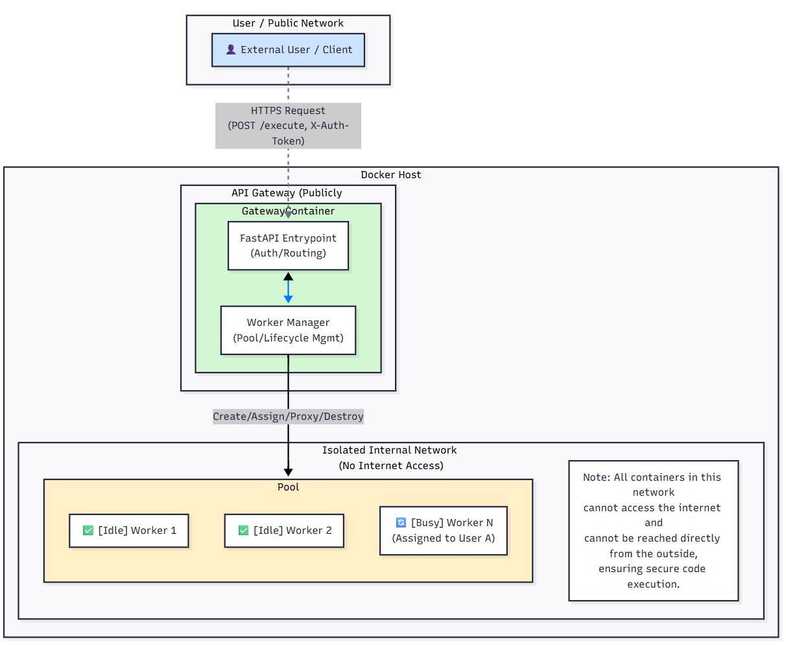
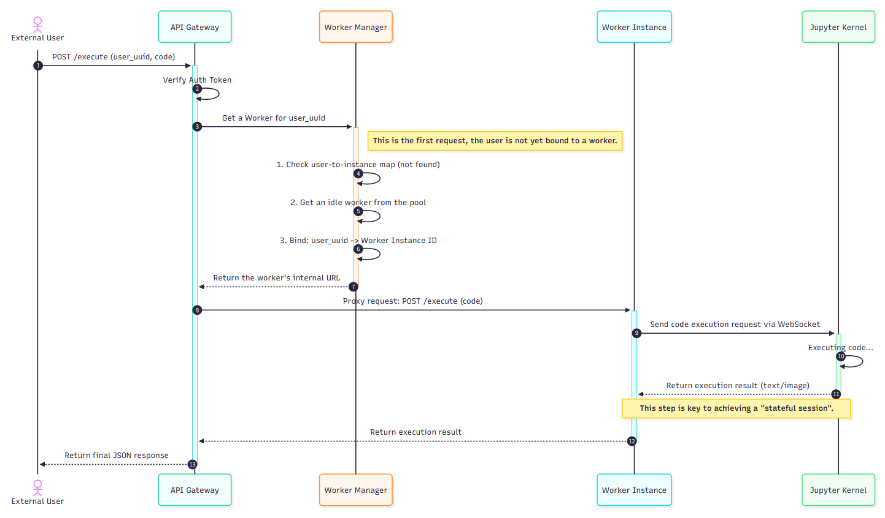

# Code Interpreter - Stateful, High-Performance, Scalable, and Secure Python Sandbox

This project is an API-driven Python code execution sandbox. It utilizes a centralized **API Gateway** and a dynamic **Worker Pool** architecture to provide each user with a completely isolated, stateful Python execution session.

Each worker instance runs in a separate Docker container with resource and network limitations. It maintains the code execution context through an internal Jupyter Kernel, offering ultimate security, session continuity, and high performance.

## Core Features

-   **Stateful Sessions**: Each user (identified by `user_uuid`) is uniquely mapped to a worker instance during their session. This ensures that variables, function definitions, and imported packages are persisted across consecutive API requests.

-   **Ultimate Isolation & Security**:
    -   **Centralized Access Control**: All requests must pass through the API Gateway, which handles unified token authentication. Worker instances are not directly exposed to the public.
    -   **Network Isolation**: All worker instances run within a **completely isolated internal Docker network**. This means workers cannot access the internet, nor can they be accessed directly from external networks, effectively preventing data leaks and malicious network attacks.
    -   **Process/Resource Isolation**: Each worker instance operates in its own Docker container, achieving OS-level resource isolation.

-   **High Performance & Concurrency**:
    -   **Pooling Architecture**: The system maintains a pre-warmed pool of idle worker instances. When a user makes their first request, the gateway instantly allocates an instance from the pool, achieving near-zero latency for sandbox environment acquisition.
    -   **Fully Asynchronous Design**: Both the Gateway and Workers are built with FastAPI, making the entire request-handling pipeline asynchronous and capable of managing a high volume of concurrent requests.

-   **High Robustness & Self-Healing**:
    -   **Health Checks**: The gateway performs strict health checks on worker instances before creating and assigning them, ensuring all internal services are fully operational.
    -   **Timeout Auto-Reset**: If code execution exceeds a predefined threshold, the Jupyter Kernel within the worker instance is automatically reset to prevent infinite loops or long-running operations from overwhelming the environment.
    -   **Idle Auto-Recycling**: A background task in the gateway periodically checks for and recycles instances that have been inactive for too long, automatically freeing up resources and maintaining the minimum number of idle instances in the pool.
    -   **Proactive Session Release**: The `/release` endpoint allows users to actively terminate their sessions and immediately destroy the associated instance, freeing up resources on demand.

## Architecture Overview

The project consists of two main components: the **API Gateway** and the **Worker Instance**.

1.  **API Gateway**
    *   Serves as the single entry point for all external API requests.
    *   **Authentication Hub**: Validates the `X-Auth-Token` in all request headers.
    *   **Worker Pool Manager (`WorkerManager`)**:
        *   Maintains a pool of `Worker` containers, including a minimum number of idle instances.
        *   When a request from a new user is received, it takes an idle instance from the pool and binds it to the user's `user_uuid`.
        *   Dynamically creates new instances if the pool is empty and the total number of workers is below the maximum limit.
        *   Manages the entire lifecycle of instances, including creation, health checks, idle recycling, and destruction.
    *   **Request Proxying**: Transparently proxies authenticated and assigned requests to the corresponding internal worker instance.

2.  **Worker Instance**
    *   A standardized, self-contained Docker container that serves as the actual code execution unit.
    -   Inside the container, `Supervisor` manages two core processes:
        *   **Jupyter Kernel**: Provides a stateful Python runtime environment, which is key to achieving session continuity.
        *   **FastAPI Service**: Exposes a simple internal HTTP API (`/execute`, `/reset`, `/health`) to receive commands from the Gateway.
    *   **Kernel Manager (`JupyterKernelManager`)**:
        *   The FastAPI service uses this module to interact with the Jupyter Kernel, sending code via WebSocket and capturing output, images, or errors in real-time.

### High-Level System Architecture

This diagram illustrates the overall system layout, emphasizing the core security design of "public access" versus "internal isolation" and depicting the relationships between the main components.



### Core Request Flow (`/execute` endpoint)

This sequence diagram details the complete top-to-bottom call chain within the system when a **new user** first initiates a code execution request, clearly showing the interaction sequence and logic between components.



## Quick Start

### 1. Prerequisites

-   [Docker](https://www.docker.com/) and [Docker Compose](https://docs.docker.com/compose/) are installed and running correctly.
-   An HTTP client that can send requests (e.g., cURL, Postman, or Python's `httpx` library).
-   For Linux/macOS users, Bash or Zsh is recommended.
-   For Windows users, PowerShell is required.

### 2. Start the Service

This project provides wrapper scripts to simplify the deployment process and hide the complexity of `docker-compose`. Please **do not** run `docker-compose up` directly.

-   **For Linux / macOS Users:**
    Open a terminal and run the following command in the project root directory:
    ```bash
    sh start.sh
    ```

-   **For Windows Users:**
    Open PowerShell and run the following command in the project root directory:
    ```powershell
    .\start.ps1
    ```
The script will automatically build the images, start the services, and clean up any temporary containers. Once started, the gateway will listen for requests on `http://127.0.0.1:3874`.

### 3. Get the Auth Token

When the service starts for the first time, a unique authentication token is automatically generated (you can also find it in the logs of the `gateway` container). You can retrieve it from the running gateway container with the following command:

```bash
docker exec code-interpreter_gateway cat /gateway/auth_token.txt
```
Please copy this token for use in subsequent API requests.
You can open the `test.html` file in the project directory to test the API, or use the Python example code below.

### 4. Stop the Service

When you are finished, please use the corresponding stop script to completely shut down and clean up all resources, including the dynamically created worker containers.

-   **For Linux / macOS Users:**
    ```bash
    sh stop.sh
    ```

-   **For Windows Users:**
    ```powershell
    .\stop.ps1
    ```

## API Documentation

All API requests should be sent to the Gateway address (default: `http://127.0.0.1:3874`).

### Authentication

All endpoints require an authentication token to be provided in the HTTP request header.
-   **Header**: `X-Auth-Token`
-   **Value**: `<your-auth-token>`

---

### 1. Execute Code

Executes a snippet of Python code within a user's session.

-   **Endpoint**: `POST /execute`
-   **Description**: Assigns a worker instance to the specified `user_uuid` (if one doesn't already exist) and then executes the code in that instance. Subsequent requests with the same `user_uuid` will be executed in the same instance, thus maintaining state.
-   **Request Body**:
    ```json
    {
      "user_uuid": "string",
      "code": "string"
    }
    ```
    -   `user_uuid` (string, required): A unique identifier for the user. A UUID is recommended.
    -   `code` (string, required): The Python code string to be executed.

-   **Success Response (200 OK)**:
    ```json
    {
      "result_text": "string | null",
      "result_base64": "string | null"
    }
    ```
    -   `result_text`: The standard output (stdout) of the code or the text representation of the last expression.
    -   `result_base64`: If the code generates an image (e.g., using matplotlib), this field will contain the Base64-encoded string of the PNG image.

-   **Error Responses**:
    -   `400 Bad Request`: Code execution failed (e.g., syntax error) or timed out.
    -   `401 Unauthorized`: The authentication token is invalid or missing.
    -   `503 Service Unavailable`: The worker pool is full or initializing, and no worker is currently available.

---

### 2. Release Session

Proactively ends a user's session and destroys its associated worker instance.

-   **Endpoint**: `POST /release`
-   **Description**: Immediately recycles the resources occupied by the specified `user_uuid`. If not called, the instance will be automatically recycled by the system after a period of inactivity.
-   **Request Body**:
    ```json
    {
      "user_uuid": "string"
    }
    ```
    -   `user_uuid` (string, required): The user identifier for the session to be released.

-   **Success Response (200 OK)**:
    ```json
    {
      "status": "ok",
      "detail": "Worker for user <user_uuid> has been released."
    }
    ```

---

### 3. Get System Status (Admin Interface)

Queries the current status of the worker pool.

-   **Endpoint**: `GET /status`
-   **Description**: Returns summary information about the number and status of worker instances, mainly for monitoring and debugging.
-   **Request Body**: None
-   **Success Response (200 OK)**:
    ```json
    {
        "total_workers": 10,
        "busy_workers": 3,
        "idle_workers_in_pool": 2,
        "is_initializing": false
    }
    ```

## Usage Example (Python)

Below is a complete example of interacting with the service using the `httpx` library.

```python
import httpx
import asyncio
import uuid
import base64
import os
import subprocess

# --- Configuration ---
GATEWAY_URL = "http://127.0.0.1:3874"
AUTH_TOKEN = "" # Will be populated below

# Generate a unique user ID for this session
USER_ID = str(uuid.uuid4())

HEADERS = {}

def get_auth_token():
    """Fetches the auth token from the container using a docker exec command."""
    try:
        token = subprocess.check_output(
            ["docker", "exec", "code-interpreter_gateway", "cat", "/gateway/auth_token.txt"],
            text=True
        ).strip()
        return token
    except (subprocess.CalledProcessError, FileNotFoundError):
        print("❌ Could not automatically fetch Auth Token. Ensure the service is running via start.sh/start.ps1.")
        print("   Please run 'docker exec code-interpreter_gateway cat /gateway/auth_token.txt' manually and paste the token into the AUTH_TOKEN variable.")
        return None

async def execute_code(client: httpx.AsyncClient, session_id: str, code: str):
    """A helper function to send an execution request and print the results."""
    print(f"\n--- Executing Code ---\n{code.strip()}")
    payload = {"user_uuid": session_id, "code": code}
    
    try:
        response = await client.post(f"{GATEWAY_URL}/execute", json=payload, headers=HEADERS, timeout=30.0)
        response.raise_for_status() # Raises an exception for 4xx/5xx status codes
        
        data = response.json()
        if data.get("result_text"):
            print(">>> Text Result:\n" + data["result_text"])
        if data.get("result_base64"):
            print(">>> Image generated successfully! (Received base64-encoded PNG data)")
            # Optional: Save the image data to a file
            img_data = base64.b64decode(data["result_base64"])
            output_filename = f"output_{session_id[:8]}.png"
            with open(output_filename, "wb") as f:
                f.write(img_data)
            print(f"    Image saved as {output_filename}")
            
    except httpx.HTTPStatusError as e:
        print(f"Execution failed: {e.response.status_code} - {e.response.text}")
    except httpx.RequestError as e:
        print(f"Request error: {e}")

async def release_session(client: httpx.AsyncClient, session_id: str):
    """A helper function to release a session."""
    print("\n--- Releasing worker instance ---")
    release_payload = {"user_uuid": session_id}
    response = await client.post(f"{GATEWAY_URL}/release", json=release_payload, headers=HEADERS)
    if response.status_code == 200:
        print("Successfully released:", response.json().get('detail'))
    else:
        print("Failed to release:", response.text)


async def main():
    global AUTH_TOKEN, HEADERS
    AUTH_TOKEN = get_auth_token()
    if not AUTH_TOKEN:
        return
        
    HEADERS = {"X-Auth-Token": AUTH_TOKEN}
    print(f"✅ Successfully fetched token: ...{AUTH_TOKEN[-6:]}")

    async with httpx.AsyncClient() as client:
        # Example 1: Define variables
        await execute_code(client, USER_ID, "a = 10\nb = 20")
        
        # Example 2: Reuse the variables 'a' and 'b' from the previous execution (stateful)
        await execute_code(client, USER_ID, "result = a * b\nprint(f'The product is {result}')\nresult")

        # Example 3: Generate an image (matplotlib)
        matplotlib_code = """
import matplotlib.pyplot as plt
import numpy as np

x = np.linspace(0, 10, 100)
y = np.sin(x)

plt.figure(figsize=(5, 3))
plt.plot(x, y)
plt.title('Sine Wave')
plt.grid(True)
plt.show()
        """
        await execute_code(client, USER_ID, matplotlib_code)

        # Example 4: Proactively release the session and its resources
        await release_session(client, USER_ID)


if __name__ == "__main__":
    asyncio.run(main())

```

## Roadmap

-   [ ] Add file upload/download functionality
-   [ ] Implement more granular resource limits (CPU, Memory)
-   [ ] Support for custom Python environments and pre-installed libraries
- 