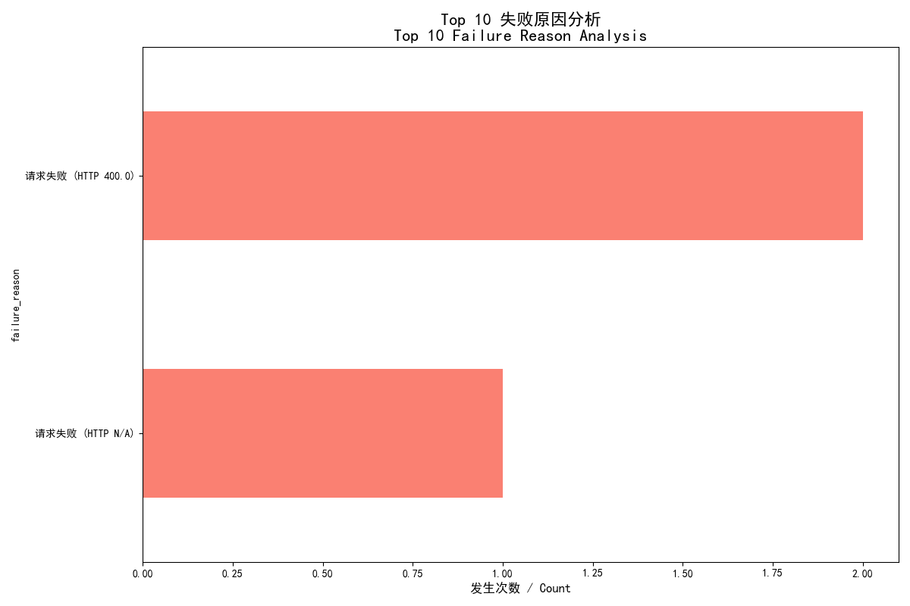

# Code Interpreter: A Stateful, High-Performance, and Secure Python Sandbox API

This project delivers a robust, API-driven Python code execution sandbox. It features a centralized **API Gateway** and a dynamic **Worker Pool** architecture, providing each user with a completely isolated, stateful, and persistent Python session.

Each worker instance operates within a separate Docker container, sandboxed with strict resource and network limitations. By leveraging an internal Jupyter Kernel, it maintains the complete code execution context (variables, imports, functions) across multiple API calls, ensuring ultimate security, session continuity, and high performance.

## Core Features

-   **Stateful Sessions**: Each user (identified by `user_uuid`) is uniquely mapped to a dedicated worker instance. This guarantees that variables, function definitions, and imported libraries are persisted across consecutive API requests, enabling complex, multi-step computations.

-   **Ultimate Isolation & Security**:
    -   **Centralized Access Control**: All requests are routed through the API Gateway, which enforces unified token authentication. Worker instances are never directly exposed to the public.
    -   **Complete Network Isolation**: All worker instances run within a **fully isolated internal Docker network** (`internal: true`). This prevents workers from accessing the internet or any external networks, effectively thwarting data exfiltration and malicious network attacks.
    -   **Process & Resource Isolation**: Each worker runs in its own Docker container, providing OS-level resource isolation and preventing any interference between user sessions.

-   **High Performance & Concurrency**:
    -   **Pre-warmed Worker Pool**: The system maintains a pool of idle, ready-to-use worker instances. When a new user makes a request, an instance is instantly allocated from the pool, eliminating environment startup latency.
    -   **Fully Asynchronous Design**: Built entirely with FastAPI and asynchronous libraries, both the Gateway and Workers can handle a high volume of concurrent requests efficiently.

-   **High Robustness & Self-Healing**:
    -   **Health Checks**: The gateway performs rigorous health checks on worker instances before assigning them, ensuring all internal services are fully operational.
    -   **Timeout Auto-Reset**: If code execution exceeds a predefined threshold, the Jupyter Kernel within the worker is automatically reset, preventing infinite loops or long-running operations from monopolizing resources.
    -   **Idle Auto-Recycling**: A background task in the gateway periodically recycles instances that have been inactive for too long, automatically freeing up resources and maintaining the health of the worker pool.
    -   **Proactive Session Release**: The `/release` endpoint allows users to explicitly terminate their sessions and immediately destroy the associated instance.

## Performance Benchmarks

The system was stress-tested on different hardware configurations to validate its performance and scalability.

---

### **Test 1: High-End Desktop (AMD 9950X, 128GB RAM)**

-   **Test Scenario**: **30 concurrent users**, each sending 100 stateful requests.
-   **Total Requests**: 3,000
-   **Test Duration**: 79.51 seconds
-   **Throughput (RPS)**: **~37.7 req/s**
-   **Request Success Rate**: **99.9%**
-   **State Verification Success Rate**: **100%**
-   **P95 Latency**: **262.92 ms**

---

### **Test 2: Mid-Range Desktop (Intel i5-14400, 16GB RAM)**

-   **Test Scenario**: **25 concurrent users**, each sending 100 stateful requests.
-   **Total Requests**: 2,500
-   **Test Duration**: 69.61 seconds
-   **Throughput (RPS)**: **~35.9 req/s**
-   **Request Success Rate**: **100%**
-   **State Verification Success Rate**: **100%**
-   **P95 Latency**: **404.15 ms**

---

### Result Charts (from High-End Test)

The following charts visualize the results from the high-end desktop test, demonstrating excellent reliability and performance.

**1. Overall Test Summary**
*A breakdown of successful, verification-failed, and request-failed calls, demonstrating high reliability.*


**2. Latency Distribution**
*The distribution of request latencies for successfully verified requests, showing most responses are handled quickly.*


**3. Failure Analysis**
*An analysis of the rare failure cases, which primarily consist of transient network errors or code errors, not systemic issues.*


## Architecture Overview

The project consists of two core components: the **API Gateway** and the **Worker Instance**.

1.  **API Gateway**
    *   Serves as the single, authenticated entry point for all external API requests.
    *   **Worker Pool Manager (`WorkerManager`)**: Manages the entire lifecycle of worker instances, including creation, health checks, allocation, idle recycling, and destruction.
    *   **Request Proxy**: Transparently proxies validated requests to the correct internal worker instance assigned to a user.

2.  **Worker Instance**
    *   A standardized, self-contained Docker container that acts as the code execution unit.
    *   **Internal Services**: Inside the container, `Supervisor` manages two key processes:
        *   **Jupyter Kernel**: Provides the stateful Python runtime.
        *   **FastAPI Service**: Exposes a simple internal API (`/execute`, `/health`) for the Gateway to communicate with.
    *   **Kernel Manager (`JupyterKernelManager`)**: A module within the FastAPI service that interacts with the Jupyter Kernel via WebSockets to execute code and capture results.

### High-Level System Architecture

This diagram shows the overall system layout, highlighting the "public gateway" vs. "isolated worker" security model.


### Core Request Flow (`/execute`)

This sequence diagram details the interaction between components when a new user initiates their first code execution request.


## Quick Start

### 1. Prerequisites

-   [Docker](https://www.docker.com/) and [Docker Compose](https://docs.docker.com/compose/) installed and running.
-   An HTTP client (e.g., cURL, Postman, or Python's `httpx`).
-   Bash/Zsh for Linux/macOS or PowerShell for Windows.

### 2. Start the Service

Convenience scripts are provided to handle the startup process. **Do not** run `docker-compose up` directly.

-   **Linux / macOS:**
    ```bash
    sh start.sh
    ```

-   **Windows (PowerShell):**
    ```powershell
    .\start.ps1
    ```
The script will build the images, start the services, and clean up temporary containers. The gateway will listen on `http://127.0.0.1:3874`.

### 3. Get the Auth Token

A unique auth token is generated on the first startup. Retrieve it from the running gateway container:

```bash
docker exec code-interpreter_gateway cat /gateway/auth_token.txt
```
Copy this token for use in API requests. You can use the included `test.html` for a quick UI test.

### 4. Stop the Service

Use the provided scripts to completely shut down and clean up all resources, including dynamically created worker containers.

-   **Linux / macOS:**
    ```bash
    sh stop.sh
    ```

-   **Windows (PowerShell):**
    ```powershell
    .\stop.ps1
    ```

## API Documentation

All requests are sent to the Gateway address (default: `http://127.0.0.1:3874`).

### Authentication

All endpoints require an authentication token in the request header.
-   **Header**: `X-Auth-Token`
-   **Value**: `<your-auth-token>`

---

### 1. Execute Code

-   **Endpoint**: `POST /execute`
-   **Description**: Executes Python code within a user's stateful session. If it's the first request for a `user_uuid`, a worker is assigned. Subsequent requests use the same worker.
-   **Request Body**:
    ```json
    {
      "user_uuid": "string",
      "code": "string"
    }
    ```
-   **Success Response (200 OK)**:
    ```json
    {
      "result_text": "string | null",
      "result_base64": "string | null"
    }
    ```
    -   `result_text`: Standard output or the text representation of the result.
    -   `result_base64`: A Base64-encoded PNG image if the code generates a plot.

---

### 2. Release Session

-   **Endpoint**: `POST /release`
-   **Description**: Proactively terminates a user's session and destroys its associated worker instance, freeing up resources.
-   **Request Body**:
    ```json
    {
      "user_uuid": "string"
    }
    ```
-   **Success Response (200 OK)**:
    ```json
    {
      "status": "ok",
      "detail": "Worker for user <user_uuid> has been released."
    }
    ```

---

### 3. Get System Status (Admin)

-   **Endpoint**: `GET /status`
-   **Description**: Returns a summary of the worker pool's status for monitoring.
-   **Success Response (200 OK)**:
    ```json
    {
        "total_workers": 10,
        "busy_workers": 3,
        "idle_workers_in_pool": 2,
        "is_initializing": false
    }
    ```

## Usage Example (Python)

A complete example using the `httpx` library to demonstrate stateful execution.

```python
import httpx
import asyncio
import uuid
import base64
import subprocess

# --- Configuration ---
GATEWAY_URL = "http://127.0.0.1:3874"
AUTH_TOKEN = "" # Will be populated automatically

# Generate a unique user ID for this session
USER_ID = str(uuid.uuid4())
HEADERS = {}

def get_auth_token():
    """Fetches the auth token from the running container."""
    try:
        token = subprocess.check_output(
            ["docker", "exec", "code-interpreter_gateway", "cat", "/gateway/auth_token.txt"],
            text=True
        ).strip()
        return token
    except (subprocess.CalledProcessError, FileNotFoundError):
        print("❌ Could not fetch Auth Token. Is the service running?")
        return None

async def execute_code(client: httpx.AsyncClient, session_id: str, code: str):
    """Sends code to the gateway and prints the result."""
    print(f"\n--- Executing ---\n{code.strip()}")
    payload = {"user_uuid": session_id, "code": code}
    try:
        response = await client.post(f"{GATEWAY_URL}/execute", json=payload, headers=HEADERS, timeout=30.0)
        response.raise_for_status()
        data = response.json()
        if data.get("result_text"):
            print(">>> Text Result:\n" + data["result_text"])
        if data.get("result_base64"):
            print(">>> Image generated! (output.png saved)")
            with open("output.png", "wb") as f:
                f.write(base64.b64decode(data["result_base64"]))
    except httpx.HTTPStatusError as e:
        print(f"Execution failed: {e.response.status_code} - {e.response.text}")

async def release_session(client: httpx.AsyncClient, session_id: str):
    """Releases the worker instance for the session."""
    print("\n--- Releasing worker ---")
    response = await client.post(f"{GATEWAY_URL}/release", json={"user_uuid": session_id}, headers=HEADERS)
    print(f"Released with status {response.status_code}: {response.json().get('detail')}")

async def main():
    global AUTH_TOKEN, HEADERS
    AUTH_TOKEN = get_auth_token()
    if not AUTH_TOKEN: return
    HEADERS = {"X-Auth-Token": AUTH_TOKEN}
    print(f"✅ Token fetched successfully: ...{AUTH_TOKEN[-6:]}")

    async with httpx.AsyncClient() as client:
        # 1. Define a variable
        await execute_code(client, USER_ID, "a = 100")
        
        # 2. Use the variable 'a' in a new request (demonstrates statefulness)
        await execute_code(client, USER_ID, "b = a * 5\nprint(b)")

        # 3. Generate a plot
        matplotlib_code = """
import matplotlib.pyplot as plt
import numpy as np
x = np.linspace(0, 2 * np.pi, 200)
y = np.sin(x)
plt.plot(x, y)
plt.title('Sine Wave')
plt.show()
        """
        await execute_code(client, USER_ID, matplotlib_code)

        # 4. Release the session
        await release_session(client, USER_ID)

if __name__ == "__main__":
    asyncio.run(main())
```

## Roadmap

-   [ ] Implement file upload/download functionality.
-   [ ] Introduce more granular resource limits (e.g., CPU, Memory per container).
-   [ ] Support for custom Python environments and pre-installed libraries.
