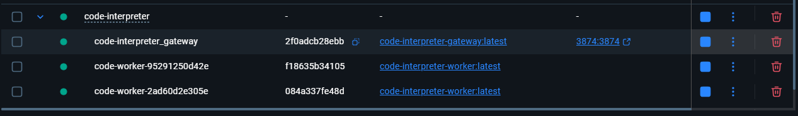

# Code Interpreter - 有状态、高性能、可伸缩、高安全性的 Python 代码沙箱

本项目是一个通过 API 驱动的 Python 代码执行沙箱。它采用中心化的 **API 网关 (Gateway)** 和动态的 **工作实例池 (Worker Pool)** 架构，为每个用户提供完全隔离的、有状态的 Python 执行会话。

每个工作实例都在一个独立的、受资源和网络限制的 Docker 容器中运行，并通过内部的 Jupyter Kernel 保持代码执行的上下文状态，提供了极致的安全性、会话连续性和高性能。

## 核心特性

-   **有状态会话**: 每个用户 (通过 `user_uuid` 标识) 在会话期间会被唯一地映射到一个工作实例，从而保证了变量、函数定义和导入的包在连续的 API 请求之间得以保持。

-   **极致隔离与安全**:
    -   **中心化访问控制**: 所有的请求都必须通过 API 网关，网关负责统一的令牌认证，工作实例不直接暴露于外部。
    -   **网络隔离**: 所有工作实例都运行在一个**完全隔离的 Docker 内部网络**中。这意味着工作实例无法访问互联网，也无法被外部网络直接访问，有效防止了数据外泄和恶意代码的网络攻击。
    -   **进程/资源隔离**: 每个工作实例运行在独立的 Docker 容器中，实现了操作系统级别的资源隔离。

-   **高性能与高并发**:
    -   **池化架构**: 系统维护一个预热的空闲工作实例池。当用户首次请求时，网关会立即从池中分配一个实例，实现了近乎零延迟的沙箱环境获取。
    -   **全异步设计**: 网关和工作实例均基于 FastAPI 构建，整个请求处理链路完全异步化，能够轻松处理大量并发请求。

-   **高鲁棒性与自愈能力**:
    -   **健康检查**: 网关在创建并分配工作实例前会对其进行严格的健康检查，确保内部服务完全就绪。
    -   **超时自动重置**: 当代码执行时间超过预设阈值时，工作实例内部的 Jupyter Kernel 会被自动重置，以防死循环或长时间的阻塞操作拖垮环境。
    -   **闲置自动回收**: 网关的后台任务会周期性地检查并回收长时间未活动的实例，自动释放资源，并维持池中最小空闲实例数。
    -   **会话主动释放**: 提供了 `/release` 接口，允许用户主动结束会话并立即销毁其实例，释放资源。



## 架构解析

项目主要由两大部分组成：**API 网关 (Gateway)** 和 **工作实例 (Worker)**。

1.  **API 网关 (Gateway)**
    *   作为系统的唯一入口，负责接收所有外部 API 请求。
    *   **认证中心**: 校验所有请求头中的 `X-Auth-Token`。
    *   **工作池管理器 (`WorkerManager`)**:
        *   维护一个由 `Worker` 容器组成的池，包括一个最小数量的空闲实例。
        *   当接收到新用户的请求时，从池中取出一个空闲实例并与该用户的 `user_uuid` 绑定。
        *   如果池中没有空闲实例且未达到总数上限，则动态创建新的实例。
        *   负责实例的生命周期管理，包括创建、健康检查、闲置回收和销毁。
    *   **请求代理**: 将已认证和分配的请求，透明地代理到对应的内部工作实例上。

2.  **工作实例 (Worker)**
    *   一个标准化的、自包含的 Docker 容器，是实际的代码执行单元。
    -   容器内部由 `Supervisor` 管理两个核心进程：
        *   **Jupyter Kernel**: 提供一个有状态的 Python 运行时环境。这是实现会话连续性的关键。
        *   **FastAPI 服务**: 暴露一个简单的内部 HTTP API (`/execute`, `/reset`, `/health`)，接收来自网关的指令。
    *   **内核管理器 (`JupyterKernelManager`)**:
        *   FastAPI 服务通过该模块与 Jupyter Kernel 进行交互，通过 WebSocket 发送代码并实时捕获输出、图像或错误。


这张图展示了系统的主要组成部分以及它们之间的关系，包括用户、API 网关和隔离的工作实例池。


这张时序图详细描述了当一个新用户首次发起 /execute 请求时，系统内部各组件的交互步骤。  

## 快速开始

### 1. 前提条件

-   [Docker](https://www.docker.com/) 和 [Docker Compose](https://docs.docker.com/compose/) 已正确安装并正在运行。
-   一个可以发送 HTTP 请求的客户端 (如 cURL, Postman, 或者 Python 的 `httpx` 库)。
-   对于 Linux/macOS 用户，推荐使用 Bash 或 Zsh。
-   对于 Windows 用户，需要使用 PowerShell。

### 2. 启动服务

本项目提供了封装好的启动脚本，屏蔽了 `docker-compose` 的复杂性。请**不要**直接运行 `docker-compose up`。

-   **对于 Linux / macOS 用户:**
    打开终端，在项目根目录运行：
    ```bash
    sh start.sh
    ```

-   **对于 Windows 用户:**
    打开 PowerShell，在项目根目录运行：
    ```powershell
    .\start.ps1
    ```
脚本会自动构建镜像、启动服务，并清理临时容器。服务启动后，网关将在 `http://127.0.0.1:3874` 上监听请求。

### 3. 获取认证令牌

服务首次启动时，一个唯一的认证令牌会自动生成（你也可以从 gateway 容器的 logs 中找到）。你可以通过以下命令从正在运行的网关容器中获取它：

```bash
docker exec code-interpreter_gateway cat /gateway/auth_token.txt
```
请复制这个令牌，并在后续的 API 请求中使用。  
你可以访问项目目录下的 `test.html` 来测试 API，或者使用下面的 Python 示例代码。


### 4. 停止服务

当你完成使用后，请使用对应的停止脚本来彻底关闭并清理所有资源，包括动态创建的 worker 容器。

-   **对于 Linux / macOS 用户:**
    ```bash
    sh stop.sh
    ```

-   **对于 Windows 用户:**
    ```powershell
    .\stop.ps1
    ```

## API 接口文档

所有 API 请求都应发送到 Gateway 地址 (默认为 `http://127.0.0.1:3874`)。

### 认证

所有接口都需要在 HTTP 请求头中提供认证令牌。
-   **Header**: `X-Auth-Token`
-   **Value**: `<你的认证令牌>`

---

### 1. 执行代码

在用户的会话中执行一段 Python 代码。

-   **Endpoint**: `POST /execute`
-   **描述**: 为指定的 `user_uuid` 分配一个工作实例（如果尚不存在），然后在该实例中执行代码。后续使用相同 `user_uuid` 的请求将在同一个实例中执行，从而维持状态。
-   **Request Body**:
    ```json
    {
      "user_uuid": "string",
      "code": "string"
    }
    ```
    -   `user_uuid` (string, required): 用户的唯一标识符。建议使用 UUID。
    -   `code` (string, required): 需要执行的 Python 代码字符串。

-   **Success Response (200 OK)**:
    ```json
    {
      "result_text": "string | null",
      "result_base64": "string | null"
    }
    ```
    -   `result_text`: 代码的标准输出 (stdout) 或最后一个表达式的文本表示。
    -   `result_base64`: 如果代码生成了图像 (例如使用 matplotlib)，此字段将包含 PNG 图像的 Base64 编码字符串。

-   **Error Responses**:
    -   `400 Bad Request`: 代码执行出错（例如语法错误）或执行超时。
    -   `401 Unauthorized`: 认证令牌无效或缺失。
    -   `503 Service Unavailable`: 工作池已满，或正在初始化，暂时没有可用的工作实例。

---

### 2. 释放会话

主动结束一个用户的会话并销毁其关联的工作实例。

-   **Endpoint**: `POST /release`
-   **描述**: 立即回收指定 `user_uuid` 占用的资源。如果不主动调用，实例也会在闲置超时后被系统自动回收。
-   **Request Body**:
    ```json
    {
      "user_uuid": "string"
    }
    ```
    -   `user_uuid` (string, required): 需要释放的会话的用户标识符。

-   **Success Response (200 OK)**:
    ```json
    {
      "status": "ok",
      "detail": "Worker for user <user_uuid> has been released."
    }
    ```

---

### 3. 获取系统状态 (管理接口)

查询当前工作池的状态。

-   **Endpoint**: `GET /status`
-   **描述**: 返回关于工作实例数量和状态的摘要信息，主要用于监控和调试。
-   **Request Body**: None
-   **Success Response (200 OK)**:
    ```json
    {
        "total_workers": 10,
        "busy_workers": 3,
        "idle_workers_in_pool": 2,
        "is_initializing": false
    }
    ```

## 使用示例 (Python)

下面是一个使用 `httpx` 库与服务交互的完整示例。

```python
import httpx
import asyncio
import uuid
import base64
import os
import subprocess

# --- 配置 ---
GATEWAY_URL = "http://127.0.0.1:3874"
AUTH_TOKEN = "" # 将在此处填充

# 为这个会话生成一个唯一的用户 ID
USER_ID = str(uuid.uuid4())

HEADERS = {}

def get_auth_token():
    """通过 docker exec 命令从容器中获取令牌"""
    try:
        token = subprocess.check_output(
            ["docker", "exec", "code-interpreter_gateway", "cat", "/gateway/auth_token.txt"],
            text=True
        ).strip()
        return token
    except (subprocess.CalledProcessError, FileNotFoundError):
        print("❌ 无法自动获取 Auth Token。请确保服务已通过 start.sh/start.ps1 启动。")
        print("   请手动运行 'docker exec code-interpreter_gateway cat /gateway/auth_token.txt' 并将令牌粘贴到 AUTH_TOKEN 变量中。")
        return None

async def execute_code(client: httpx.AsyncClient, session_id: str, code: str):
    """一个辅助函数，用于发送执行请求并打印结果。"""
    print(f"\n--- 正在执行代码 ---\n{code.strip()}")
    payload = {"user_uuid": session_id, "code": code}
    
    try:
        response = await client.post(f"{GATEWAY_URL}/execute", json=payload, headers=HEADERS, timeout=30.0)
        response.raise_for_status() # 如果状态码不是 2xx，则抛出异常
        
        data = response.json()
        if data.get("result_text"):
            print(">>> 文本结果:\n" + data["result_text"])
        if data.get("result_base64"):
            print(">>> 成功生成图像！(返回 base64 编码的 PNG 数据)")
            # 可选：将图像数据保存到文件
            img_data = base64.b64decode(data["result_base64"])
            output_filename = f"output_{session_id[:8]}.png"
            with open(output_filename, "wb") as f:
                f.write(img_data)
            print(f"    图像已保存为 {output_filename}")
            
    except httpx.HTTPStatusError as e:
        print(f"执行失败: {e.response.status_code} - {e.response.text}")
    except httpx.RequestError as e:
        print(f"请求错误: {e}")

async def release_session(client: httpx.AsyncClient, session_id: str):
    """辅助函数，用于释放会话。"""
    print("\n--- 正在释放工作实例 ---")
    release_payload = {"user_uuid": session_id}
    response = await client.post(f"{GATEWAY_URL}/release", json=release_payload, headers=HEADERS)
    if response.status_code == 200:
        print("成功释放:", response.json().get('detail'))
    else:
        print("释放失败:", response.text)


async def main():
    global AUTH_TOKEN, HEADERS
    AUTH_TOKEN = get_auth_token()
    if not AUTH_TOKEN:
        return
        
    HEADERS = {"X-Auth-Token": AUTH_TOKEN}
    print(f"✅ 成功获取令牌: ...{AUTH_TOKEN[-6:]}")

    async with httpx.AsyncClient() as client:
        # 示例 1: 定义变量
        await execute_code(client, USER_ID, "a = 10\nb = 20")
        
        # 示例 2: 复用上一次执行的变量 'a' 和 'b' (有状态)
        await execute_code(client, USER_ID, "result = a * b\nprint(f'The product is {result}')\nresult")

        # 示例 3: 生成一个图像 (matplotlib)
        matplotlib_code = """
import matplotlib.pyplot as plt
import numpy as np

x = np.linspace(0, 10, 100)
y = np.sin(x)

plt.figure(figsize=(5, 3))
plt.plot(x, y)
plt.title('Sine Wave')
plt.grid(True)
plt.show()
        """
        await execute_code(client, USER_ID, matplotlib_code)

        # 示例 4: 主动释放会话和资源
        await release_session(client, USER_ID)


if __name__ == "__main__":
    asyncio.run(main())

```

## Roadmap

-   [ ] 增加文件上传下载功能
-   [ ] 更精细化的资源限制 (CPU, 内存)
-   [ ] 支持自定义 Python 环境和预装库
