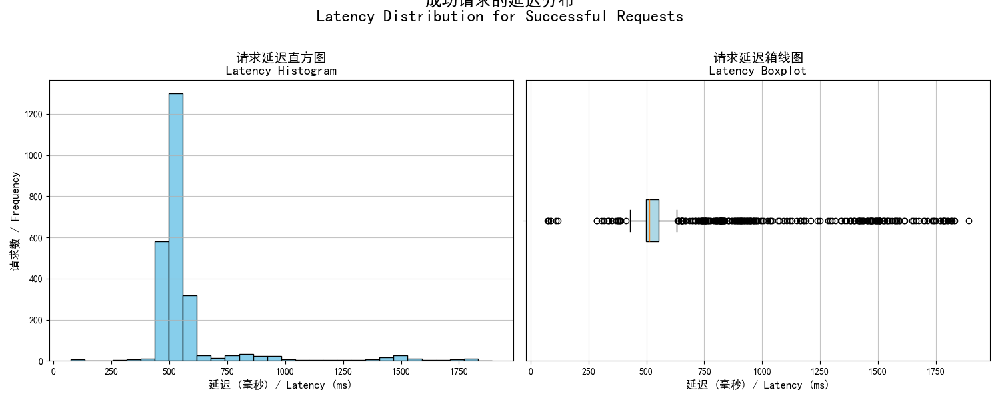

# Code Interpreter：一个有状态、高性能、高安全性的 Python 代码沙箱 API

本项目是一个通过 API 驱动的、强大的 Python 代码执行沙箱。它采用中心化的 **API 网关 (Gateway)** 和动态的 **工作实例池 (Worker Pool)** 架构，为每个用户提供一个完全隔离的、有状态的、持久化的 Python 执行会话。

每个工作实例都在一个独立的 Docker 容器中运行，并受到严格的资源和网络限制。通过利用内部的 Jupyter Kernel，它能够在多次 API 调用之间保持完整的代码执行上下文（变量、导入、函数等），从而确保了极致的安全性、会話的连续性和卓越的性能。

## 核心特性

-   **有状态会话**: 每个用户 (通过 `user_uuid` 标识) 在会话期间会被唯一地映射到一个专用的工作实例。这保证了变量、函数定义和导入的库在连续的 API 请求之间得以保持，从而支持复杂的多步计算任务。

-   **极致隔离与安全**:
    -   **中心化访问控制**: 所有请求都必须通过 API 网关，网关负责统一的令牌认证，工作实例绝不直接暴露于公网。
    -   **完全网络隔离**: 所有工作实例都运行在一个**完全隔离的 Docker 内部网络**中 (`internal: true`)。这意味着工作实例无法访问互联网，也无法被外部网络直接访问，从根本上防止了数据外泄和恶意代码的网络攻击。
    -   **进程/资源隔离**: 每个工作实例运行在独立的 Docker 容器中，实现了操作系统级别的资源隔离，防止用户会话之间产生任何干扰。

-   **高性能与高并发**:
    -   **预热工作池**: 系统维护一个由空闲的、随时可用的工作实例组成的池。当新用户发起请求时，系统会立即从池中分配一个实例，从而消除了环境启动的延迟。
    -   **全异步设计**: 网关和工作实例均基于 FastAPI 和异步库构建，能够高效地处理大量并发请求。

-   **高鲁棒性与自愈能力**:
    -   **健康检查**: 网关在创建并分配工作实例前会对其进行严格的健康检查，确保内部服务完全就绪。
    -   **超时自动重置**: 当代码执行时间超过预设阈值时，工作实例内部的 Jupyter Kernel 会被自动重置，以防死循环或长时间的阻塞操作拖垮环境。
    -   **闲置自动回收**: 网关的后台任务会周期性地检查并回收长时间未活动的实例，自动释放资源，并维持工作池的健康。
    -   **会话主动释放**: 提供了 `/release` 接口，允许用户主动结束会话并立即销毁其实例。

## 性能基准测试

为了验证系统的性能和可伸缩性，我们在不同的硬件配置上进行了压力测试。

---

### **测试一：高端桌面平台 (AMD 9950X, 128GB 内存)**

-   **测试场景**: 模拟 **30 个并发用户**，每个用户发送 100 次有状态的请求。
-   **总请求数**: 3,000
-   **测试时长**: 79.51 秒
-   **吞吐量 (RPS)**: **约 37.7 请求/秒**
-   **请求成功率**: **99.9%**
-   **状态验证成功率**: **100%**
-   **P95 延迟**: **262.92 毫秒**

---

### **测试二：中端桌面平台 (Intel i5-14400, 16GB 内存)**

-   **测试场景**: 模拟 **25 个并发用户**，每个用户发送 100 次有状态的请求。
-   **总请求数**: 2,500
-   **测试时长**: 69.61 秒
-   **吞吐量 (RPS)**: **约 35.9 请求/秒**
-   **请求成功率**: **100%**
-   **状态验证成功率**: **100%**
-   **P95 延迟**: **404.15 毫秒**

---

### 测试结果图表 (源自高端平台测试)

以下图表展示了在高端桌面平台上的测试结果，直观地证明了其卓越的可靠性和性能。

**1. 整体测试结果概览**
*图表展示了成功、验证失败和请求失败的调用分布，证明了系统的高度可靠性。*


**2. 请求延迟分布**
*此图展示了成功验证请求的延迟分布，表明大多数请求都能被迅速处理。*


**3. 失败原因分析**
*对极少数失败案例的分析，主要为瞬时的网络错误或代码本身错误，而非系统性问题。*


## 架构解析

项目主要由两大部分组成：**API 网关 (Gateway)** 和 **工作实例 (Worker)**。

1.  **API 网关 (Gateway)**
    *   作为系统的唯一入口，负责接收并认证所有外部 API 请求。
    *   **工作池管理器 (`WorkerManager`)**: 负责工作实例的整个生命周期管理，包括创建、健康检查、分配、闲置回收和销毁。
    *   **请求代理**: 将通过验证的请求透明地代理到分配给该用户的正确的内部工作实例上。

2.  **工作实例 (Worker)**
    *   一个标准化的、自包含的 Docker 容器，是实际的代码执行单元。
    *   **内部服务**: 容器内部由 `Supervisor` 管理两个核心进程：
        *   **Jupyter Kernel**: 提供一个有状态的 Python 运行时环境。
        *   **FastAPI 服务**: 暴露一个简单的内部 API (`/execute`, `/health`)，用于与网关通信。
    *   **内核管理器 (`JupyterKernelManager`)**: FastAPI 服务中的一个模块，通过 WebSocket 与 Jupyter Kernel 交互，以执行代码并捕获结果。

### 高层系统架构

此图展示了系统的整体布局，强调了“公共网关”与“隔离工作区”的核心安全模型。


### 核心请求流程 (`/execute`)

该时序图详细描述了当一个新用户首次发起代码执行请求时，系统内部各组件的交互步骤。


## 快速开始

### 1. 前提条件

-   [Docker](https://www.docker.com/) 和 [Docker Compose](https://docs.docker.com/compose/) 已正确安装并正在运行。
-   一个 HTTP 客户端 (如 cURL, Postman, 或 Python 的 `httpx` 库)。
-   对于 Linux/macOS 用户，推荐使用 Bash/Zsh；对于 Windows 用户，需要使用 PowerShell。

### 2. 启动服务

项目提供了便捷的脚本来处理启动过程。请**不要**直接运行 `docker-compose up`。

-   **Linux / macOS 用户:**
    ```bash
    sh start.sh
    ```

-   **Windows 用户 (PowerShell):**
    ```powershell
    .\start.ps1
    ```
脚本会自动构建镜像、启动服务并清理临时容器。服务启动后，网关将在 `http://127.0.0.1:3874` 上监听请求。

### 3. 获取认证令牌

服务首次启动时会生成一个唯一的认证令牌。你可以从正在运行的网关容器中获取它：

```bash
docker exec code-interpreter_gateway cat /gateway/auth_token.txt
```
请复制这个令牌，并在后续的 API 请求中使用。你也可以使用项目中的 `test.html` 文件进行快速的 UI 测试。

### 4. 停止服务

使用对应的停止脚本来彻底关闭并清理所有资源，包括动态创建的 worker 容器。

-   **Linux / macOS 用户:**
    ```bash
    sh stop.sh
    ```

-   **Windows 用户 (PowerShell):**
    ```powershell
    .\stop.ps1
    ```

## API 接口文档

所有 API 请求都应发送到网关地址 (默认为 `http://127.0.0.1:3874`)。

### 认证

所有接口都需要在 HTTP 请求头中提供认证令牌。
-   **Header**: `X-Auth-Token`
-   **Value**: `<你的认证令牌>`

---

### 1. 执行代码

-   **Endpoint**: `POST /execute`
-   **描述**: 在用户的有状态会话中执行 Python 代码。如果是 `user_uuid` 的首次请求，系统会为其分配一个工作实例；后续请求将复用该实例。
-   **Request Body**:
    ```json
    {
      "user_uuid": "string",
      "code": "string"
    }
    ```
-   **Success Response (200 OK)**:
    ```json
    {
      "result_text": "string | null",
      "result_base64": "string | null"
    }
    ```
    -   `result_text`: 代码的标准输出或结果的文本表示。
    -   `result_base64`: 如果代码生成了图表，此字段为 Base64 编码的 PNG 图像。

---

### 2. 释放会话

-   **Endpoint**: `POST /release`
-   **描述**: 主动终止一个用户的会话并销毁其关联的工作实例，以释放资源。
-   **Request Body**:
    ```json
    {
      "user_uuid": "string"
    }
    ```
-   **Success Response (200 OK)**:
    ```json
    {
      "status": "ok",
      "detail": "Worker for user <user_uuid> has been released."
    }
    ```

---

### 3. 获取系统状态 (管理接口)

-   **Endpoint**: `GET /status`
-   **描述**: 返回工作池状态的摘要信息，用于监控。
-   **Success Response (200 OK)**:
    ```json
    {
        "total_workers": 10,
        "busy_workers": 3,
        "idle_workers_in_pool": 2,
        "is_initializing": false
    }
    ```

## 使用示例 (Python)

一个使用 `httpx` 库的完整示例，演示了有状态执行的流程。

```python
import httpx
import asyncio
import uuid
import base64
import subprocess

# --- 配置 ---
GATEWAY_URL = "http://127.0.0.1:3874"
AUTH_TOKEN = "" # 将被自动填充

# 为此会话生成一个唯一的用户 ID
USER_ID = str(uuid.uuid4())
HEADERS = {}

def get_auth_token():
    """从运行中的容器获取认证令牌"""
    try:
        token = subprocess.check_output(
            ["docker", "exec", "code-interpreter_gateway", "cat", "/gateway/auth_token.txt"],
            text=True
        ).strip()
        return token
    except (subprocess.CalledProcessError, FileNotFoundError):
        print("❌ 无法获取 Auth Token。服务是否已启动？")
        return None

async def execute_code(client: httpx.AsyncClient, session_id: str, code: str):
    """向网关发送代码并打印结果"""
    print(f"\n--- 正在执行 ---\n{code.strip()}")
    payload = {"user_uuid": session_id, "code": code}
    try:
        response = await client.post(f"{GATEWAY_URL}/execute", json=payload, headers=HEADERS, timeout=30.0)
        response.raise_for_status()
        data = response.json()
        if data.get("result_text"):
            print(">>> 文本结果:\n" + data["result_text"])
        if data.get("result_base64"):
            print(">>> 成功生成图像！(已保存为 output.png)")
            with open("output.png", "wb") as f:
                f.write(base64.b64decode(data["result_base64"]))
    except httpx.HTTPStatusError as e:
        print(f"执行失败: {e.response.status_code} - {e.response.text}")

async def release_session(client: httpx.AsyncClient, session_id: str):
    """释放会话的工作实例"""
    print("\n--- 正在释放工作实例 ---")
    response = await client.post(f"{GATEWAY_URL}/release", json={"user_uuid": session_id}, headers=HEADERS)
    print(f"释放状态 {response.status_code}: {response.json().get('detail')}")

async def main():
    global AUTH_TOKEN, HEADERS
    AUTH_TOKEN = get_auth_token()
    if not AUTH_TOKEN: return
    HEADERS = {"X-Auth-Token": AUTH_TOKEN}
    print(f"✅ 成功获取令牌: ...{AUTH_TOKEN[-6:]}")

    async with httpx.AsyncClient() as client:
        # 1. 定义一个变量
        await execute_code(client, USER_ID, "a = 100")
        
        # 2. 在新的请求中使用变量 'a' (演示有状态性)
        await execute_code(client, USER_ID, "b = a * 5\nprint(b)")

        # 3. 生成一个图表
        matplotlib_code = """
import matplotlib.pyplot as plt
import numpy as np
x = np.linspace(0, 2 * np.pi, 200)
y = np.sin(x)
plt.plot(x, y)
plt.title('正弦波')
plt.show()
        """
        await execute_code(client, USER_ID, matplotlib_code)

        # 4. 释放会话
        await release_session(client, USER_ID)

if __name__ == "__main__":
    asyncio.run(main())
```

## 路线图 (Roadmap)

-   [ ] 实现文件上传/下载功能。
-   [ ] 引入更精细化的资源限制（如每个容器的 CPU、内存）。
-   [ ] 支持自定义 Python 环境和预装库。
