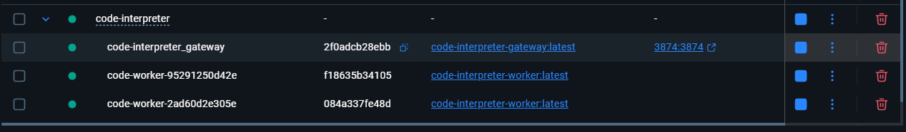
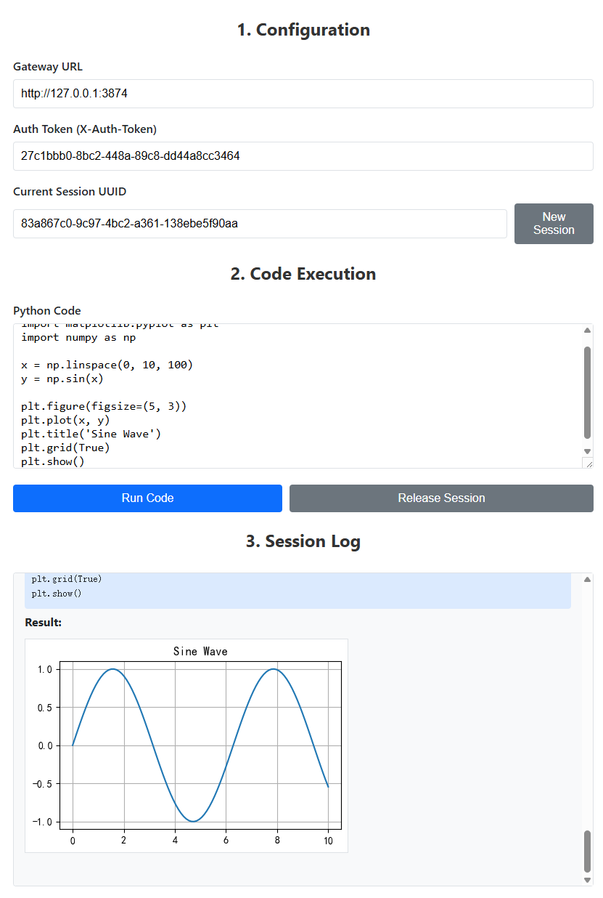

# 项目文本化总览

## 项目结构树

```
├── .gitignore
├── README.md
├── README_zh.md
├── _test.py
├── docker-compose.yml
├── generate_project_text.py
├── project_text.md
├── start.ps1
├── start.sh
├── stop.ps1
├── stop.sh
├── test.html
├── test_concurrent.py
├── gateway/
│   ├── Dockerfile
│   ├── config.py
│   ├── dto.py
│   ├── main.py
│   ├── requirements.txt
│   ├── utils.py
│   └── worker_manager.py
├── images/
│   ├── 1_test_summary_pie_chart.png
│   ├── 2_latency_distribution_chart.png
│   ├── 3_failure_analysis_bar_chart.png
│   ├── docker_desktop_screenshot.png
│   ├── high_level_architecture_en.png
│   ├── high_level_architecture_zh.png
│   ├── img_test_page.png
│   ├── request_flow_sequence_en.png
│   └── request_flow_sequence_zh.png
├── worker/
│   ├── Dockerfile
│   ├── dto.py
│   ├── kernel_manager.py
│   ├── main.py
│   ├── requirements.txt
│   ├── assets/
│   │   └── simhei.ttf
│   ├── supervisor/
│   │   └── supervisord.conf
```

## 文件内容

--- 

`README.md`

```markdown
# Code Interpreter - Stateful, High-Performance, Scalable, and Secure Python Sandbox

This project is an API-driven Python code execution sandbox. It utilizes a centralized **API Gateway** and a dynamic **Worker Pool** architecture to provide each user with a completely isolated, stateful Python execution session.

Each worker instance runs in a separate Docker container with resource and network limitations. It maintains the code execution context through an internal Jupyter Kernel, offering ultimate security, session continuity, and high performance.

## Core Features

-   **Stateful Sessions**: Each user (identified by `user_uuid`) is uniquely mapped to a worker instance during their session. This ensures that variables, function definitions, and imported packages are persisted across consecutive API requests.

-   **Ultimate Isolation & Security**:
    -   **Centralized Access Control**: All requests must pass through the API Gateway, which handles unified token authentication. Worker instances are not directly exposed to the public.
    -   **Network Isolation**: All worker instances run within a **completely isolated internal Docker network**. This means workers cannot access the internet, nor can they be accessed directly from external networks, effectively preventing data leaks and malicious network attacks.
    -   **Process/Resource Isolation**: Each worker instance operates in its own Docker container, achieving OS-level resource isolation.

-   **High Performance & Concurrency**:
    -   **Pooling Architecture**: The system maintains a pre-warmed pool of idle worker instances. When a user makes their first request, the gateway instantly allocates an instance from the pool, achieving near-zero latency for sandbox environment acquisition.
    -   **Fully Asynchronous Design**: Both the Gateway and Workers are built with FastAPI, making the entire request-handling pipeline asynchronous and capable of managing a high volume of concurrent requests.

-   **High Robustness & Self-Healing**:
    -   **Health Checks**: The gateway performs strict health checks on worker instances before creating and assigning them, ensuring all internal services are fully operational.
    -   **Timeout Auto-Reset**: If code execution exceeds a predefined threshold, the Jupyter Kernel within the worker instance is automatically reset to prevent infinite loops or long-running operations from overwhelming the environment.
    -   **Idle Auto-Recycling**: A background task in the gateway periodically checks for and recycles instances that have been inactive for too long, automatically freeing up resources and maintaining the minimum number of idle instances in the pool.
    -   **Proactive Session Release**: The `/release` endpoint allows users to actively terminate their sessions and immediately destroy the associated instance, freeing up resources on demand.

## Architecture Overview

The project consists of two main components: the **API Gateway** and the **Worker Instance**.

1.  **API Gateway**
    *   Serves as the single entry point for all external API requests.
    *   **Authentication Hub**: Validates the `X-Auth-Token` in all request headers.
    *   **Worker Pool Manager (`WorkerManager`)**:
        *   Maintains a pool of `Worker` containers, including a minimum number of idle instances.
        *   When a request from a new user is received, it takes an idle instance from the pool and binds it to the user's `user_uuid`.
        *   Dynamically creates new instances if the pool is empty and the total number of workers is below the maximum limit.
        *   Manages the entire lifecycle of instances, including creation, health checks, idle recycling, and destruction.
    *   **Request Proxying**: Transparently proxies authenticated and assigned requests to the corresponding internal worker instance.

2.  **Worker Instance**
    *   A standardized, self-contained Docker container that serves as the actual code execution unit.
    -   Inside the container, `Supervisor` manages two core processes:
        *   **Jupyter Kernel**: Provides a stateful Python runtime environment, which is key to achieving session continuity.
        *   **FastAPI Service**: Exposes a simple internal HTTP API (`/execute`, `/reset`, `/health`) to receive commands from the Gateway.
    *   **Kernel Manager (`JupyterKernelManager`)**:
        *   The FastAPI service uses this module to interact with the Jupyter Kernel, sending code via WebSocket and capturing output, images, or errors in real-time.

### High-Level System Architecture

This diagram illustrates the overall system layout, emphasizing the core security design of "public access" versus "internal isolation" and depicting the relationships between the main components.


### Core Request Flow (`/execute` endpoint)

This sequence diagram details the complete top-to-bottom call chain within the system when a **new user** first initiates a code execution request, clearly showing the interaction sequence and logic between components.


## Quick Start

### 1. Prerequisites

-   [Docker](https://www.docker.com/) and [Docker Compose](https://docs.docker.com/compose/) are installed and running correctly.
-   An HTTP client that can send requests (e.g., cURL, Postman, or Python's `httpx` library).
-   For Linux/macOS users, Bash or Zsh is recommended.
-   For Windows users, PowerShell is required.

### 2. Start the Service

This project provides wrapper scripts to simplify the deployment process and hide the complexity of `docker-compose`. Please **do not** run `docker-compose up` directly.

-   **For Linux / macOS Users:**
    Open a terminal and run the following command in the project root directory:
    ```bash
    sh start.sh
    ```

-   **For Windows Users:**
    Open PowerShell and run the following command in the project root directory:
    ```powershell
    .\start.ps1
    ```
The script will automatically build the images, start the services, and clean up any temporary containers. Once started, the gateway will listen for requests on `http://127.0.0.1:3874`.

### 3. Get the Auth Token

When the service starts for the first time, a unique authentication token is automatically generated (you can also find it in the logs of the `gateway` container). You can retrieve it from the running gateway container with the following command:

```bash
docker exec code-interpreter_gateway cat /gateway/auth_token.txt
```
Please copy this token for use in subsequent API requests.
You can open the `test.html` file in the project directory to test the API, or use the Python example code below.

### 4. Stop the Service

When you are finished, please use the corresponding stop script to completely shut down and clean up all resources, including the dynamically created worker containers.

-   **For Linux / macOS Users:**
    ```bash
    sh stop.sh
    ```

-   **For Windows Users:**
    ```powershell
    .\stop.ps1
    ```

## API Documentation

All API requests should be sent to the Gateway address (default: `http://127.0.0.1:3874`).

### Authentication

All endpoints require an authentication token to be provided in the HTTP request header.
-   **Header**: `X-Auth-Token`
-   **Value**: `<your-auth-token>`

---

### 1. Execute Code

Executes a snippet of Python code within a user's session.

-   **Endpoint**: `POST /execute`
-   **Description**: Assigns a worker instance to the specified `user_uuid` (if one doesn't already exist) and then executes the code in that instance. Subsequent requests with the same `user_uuid` will be executed in the same instance, thus maintaining state.
-   **Request Body**:
    ```json
    {
      "user_uuid": "string",
      "code": "string"
    }
    ```
    -   `user_uuid` (string, required): A unique identifier for the user. A UUID is recommended.
    -   `code` (string, required): The Python code string to be executed.

-   **Success Response (200 OK)**:
    ```json
    {
      "result_text": "string | null",
      "result_base64": "string | null"
    }
    ```
    -   `result_text`: The standard output (stdout) of the code or the text representation of the last expression.
    -   `result_base64`: If the code generates an image (e.g., using matplotlib), this field will contain the Base64-encoded string of the PNG image.

-   **Error Responses**:
    -   `400 Bad Request`: Code execution failed (e.g., syntax error) or timed out.
    -   `401 Unauthorized`: The authentication token is invalid or missing.
    -   `503 Service Unavailable`: The worker pool is full or initializing, and no worker is currently available.

---

### 2. Release Session

Proactively ends a user's session and destroys its associated worker instance.

-   **Endpoint**: `POST /release`
-   **Description**: Immediately recycles the resources occupied by the specified `user_uuid`. If not called, the instance will be automatically recycled by the system after a period of inactivity.
-   **Request Body**:
    ```json
    {
      "user_uuid": "string"
    }
    ```
    -   `user_uuid` (string, required): The user identifier for the session to be released.

-   **Success Response (200 OK)**:
    ```json
    {
      "status": "ok",
      "detail": "Worker for user <user_uuid> has been released."
    }
    ```

---

### 3. Get System Status (Admin Interface)

Queries the current status of the worker pool.

-   **Endpoint**: `GET /status`
-   **Description**: Returns summary information about the number and status of worker instances, mainly for monitoring and debugging.
-   **Request Body**: None
-   **Success Response (200 OK)**:
    ```json
    {
        "total_workers": 10,
        "busy_workers": 3,
        "idle_workers_in_pool": 2,
        "is_initializing": false
    }
    ```

## Usage Example (Python)

Below is a complete example of interacting with the service using the `httpx` library.

```python
import httpx
import asyncio
import uuid
import base64
import os
import subprocess

# --- Configuration ---
GATEWAY_URL = "http://127.0.0.1:3874"
AUTH_TOKEN = "" # Will be populated below

# Generate a unique user ID for this session
USER_ID = str(uuid.uuid4())

HEADERS = {}

def get_auth_token():
    """Fetches the auth token from the container using a docker exec command."""
    try:
        token = subprocess.check_output(
            ["docker", "exec", "code-interpreter_gateway", "cat", "/gateway/auth_token.txt"],
            text=True
        ).strip()
        return token
    except (subprocess.CalledProcessError, FileNotFoundError):
        print("❌ Could not automatically fetch Auth Token. Ensure the service is running via start.sh/start.ps1.")
        print("   Please run 'docker exec code-interpreter_gateway cat /gateway/auth_token.txt' manually and paste the token into the AUTH_TOKEN variable.")
        return None

async def execute_code(client: httpx.AsyncClient, session_id: str, code: str):
    """A helper function to send an execution request and print the results."""
    print(f"\n--- Executing Code ---\n{code.strip()}")
    payload = {"user_uuid": session_id, "code": code}
    
    try:
        response = await client.post(f"{GATEWAY_URL}/execute", json=payload, headers=HEADERS, timeout=30.0)
        response.raise_for_status() # Raises an exception for 4xx/5xx status codes
        
        data = response.json()
        if data.get("result_text"):
            print(">>> Text Result:\n" + data["result_text"])
        if data.get("result_base64"):
            print(">>> Image generated successfully! (Received base64-encoded PNG data)")
            # Optional: Save the image data to a file
            img_data = base64.b64decode(data["result_base64"])
            output_filename = f"output_{session_id[:8]}.png"
            with open(output_filename, "wb") as f:
                f.write(img_data)
            print(f"    Image saved as {output_filename}")
            
    except httpx.HTTPStatusError as e:
        print(f"Execution failed: {e.response.status_code} - {e.response.text}")
    except httpx.RequestError as e:
        print(f"Request error: {e}")

async def release_session(client: httpx.AsyncClient, session_id: str):
    """A helper function to release a session."""
    print("\n--- Releasing worker instance ---")
    release_payload = {"user_uuid": session_id}
    response = await client.post(f"{GATEWAY_URL}/release", json=release_payload, headers=HEADERS)
    if response.status_code == 200:
        print("Successfully released:", response.json().get('detail'))
    else:
        print("Failed to release:", response.text)


async def main():
    global AUTH_TOKEN, HEADERS
    AUTH_TOKEN = get_auth_token()
    if not AUTH_TOKEN:
        return
        
    HEADERS = {"X-Auth-Token": AUTH_TOKEN}
    print(f"✅ Successfully fetched token: ...{AUTH_TOKEN[-6:]}")

    async with httpx.AsyncClient() as client:
        # Example 1: Define variables
        await execute_code(client, USER_ID, "a = 10\nb = 20")
        
        # Example 2: Reuse the variables 'a' and 'b' from the previous execution (stateful)
        await execute_code(client, USER_ID, "result = a * b\nprint(f'The product is {result}')\nresult")

        # Example 3: Generate an image (matplotlib)
        matplotlib_code = """
import matplotlib.pyplot as plt
import numpy as np

x = np.linspace(0, 10, 100)
y = np.sin(x)

plt.figure(figsize=(5, 3))
plt.plot(x, y)
plt.title('Sine Wave')
plt.grid(True)
plt.show()
        """
        await execute_code(client, USER_ID, matplotlib_code)

        # Example 4: Proactively release the session and its resources
        await release_session(client, USER_ID)


if __name__ == "__main__":
    asyncio.run(main())

```

## Roadmap

-   [ ] Add file upload/download functionality
-   [ ] Implement more granular resource limits (CPU, Memory)
-   [ ] Support for custom Python environments and pre-installed libraries
- 
```

--- 

`README_zh.md`

```markdown
# Code Interpreter - 有状态、高性能、可伸缩、高安全性的 Python 代码沙箱

本项目是一个通过 API 驱动的 Python 代码执行沙箱。它采用中心化的 **API 网关 (Gateway)** 和动态的 **工作实例池 (Worker Pool)** 架构，为每个用户提供完全隔离的、有状态的 Python 执行会话。

每个工作实例都在一个独立的、受资源和网络限制的 Docker 容器中运行，并通过内部的 Jupyter Kernel 保持代码执行的上下文状态，提供了极致的安全性、会话连续性和高性能。

## 核心特性

-   **有状态会话**: 每个用户 (通过 `user_uuid` 标识) 在会话期间会被唯一地映射到一个工作实例，从而保证了变量、函数定义和导入的包在连续的 API 请求之间得以保持。

-   **极致隔离与安全**:
    -   **中心化访问控制**: 所有的请求都必须通过 API 网关，网关负责统一的令牌认证，工作实例不直接暴露于外部。
    -   **网络隔离**: 所有工作实例都运行在一个**完全隔离的 Docker 内部网络**中。这意味着工作实例无法访问互联网，也无法被外部网络直接访问，有效防止了数据外泄和恶意代码的网络攻击。
    -   **进程/资源隔离**: 每个工作实例运行在独立的 Docker 容器中，实现了操作系统级别的资源隔离。

-   **高性能与高并发**:
    -   **池化架构**: 系统维护一个预热的空闲工作实例池。当用户首次请求时，网关会立即从池中分配一个实例，实现了近乎零延迟的沙箱环境获取。
    -   **全异步设计**: 网关和工作实例均基于 FastAPI 构建，整个请求处理链路完全异步化，能够轻松处理大量并发请求。

-   **高鲁棒性与自愈能力**:
    -   **健康检查**: 网关在创建并分配工作实例前会对其进行严格的健康检查，确保内部服务完全就绪。
    -   **超时自动重置**: 当代码执行时间超过预设阈值时，工作实例内部的 Jupyter Kernel 会被自动重置，以防死循环或长时间的阻塞操作拖垮环境。
    -   **闲置自动回收**: 网关的后台任务会周期性地检查并回收长时间未活动的实例，自动释放资源，并维持池中最小空闲实例数。
    -   **会话主动释放**: 提供了 `/release` 接口，允许用户主动结束会话并立即销毁其实例，释放资源。



## 架构解析

项目主要由两大部分组成：**API 网关 (Gateway)** 和 **工作实例 (Worker)**。

1.  **API 网关 (Gateway)**
    *   作为系统的唯一入口，负责接收所有外部 API 请求。
    *   **认证中心**: 校验所有请求头中的 `X-Auth-Token`。
    *   **工作池管理器 (`WorkerManager`)**:
        *   维护一个由 `Worker` 容器组成的池，包括一个最小数量的空闲实例。
        *   当接收到新用户的请求时，从池中取出一个空闲实例并与该用户的 `user_uuid` 绑定。
        *   如果池中没有空闲实例且未达到总数上限，则动态创建新的实例。
        *   负责实例的生命周期管理，包括创建、健康检查、闲置回收和销毁。
    *   **请求代理**: 将已认证和分配的请求，透明地代理到对应的内部工作实例上。

2.  **工作实例 (Worker)**
    *   一个标准化的、自包含的 Docker 容器，是实际的代码执行单元。
    -   容器内部由 `Supervisor` 管理两个核心进程：
        *   **Jupyter Kernel**: 提供一个有状态的 Python 运行时环境。这是实现会话连续性的关键。
        *   **FastAPI 服务**: 暴露一个简单的内部 HTTP API (`/execute`, `/reset`, `/health`)，接收来自网关的指令。
    *   **内核管理器 (`JupyterKernelManager`)**:
        *   FastAPI 服务通过该模块与 Jupyter Kernel 进行交互，通过 WebSocket 发送代码并实时捕获输出、图像或错误。


这张图展示了系统的主要组成部分以及它们之间的关系，包括用户、API 网关和隔离的工作实例池。


这张时序图详细描述了当一个新用户首次发起 /execute 请求时，系统内部各组件的交互步骤。  

## 快速开始

### 1. 前提条件

-   [Docker](https://www.docker.com/) 和 [Docker Compose](https://docs.docker.com/compose/) 已正确安装并正在运行。
-   一个可以发送 HTTP 请求的客户端 (如 cURL, Postman, 或者 Python 的 `httpx` 库)。
-   对于 Linux/macOS 用户，推荐使用 Bash 或 Zsh。
-   对于 Windows 用户，需要使用 PowerShell。

### 2. 启动服务

本项目提供了封装好的启动脚本，屏蔽了 `docker-compose` 的复杂性。请**不要**直接运行 `docker-compose up`。

-   **对于 Linux / macOS 用户:**
    打开终端，在项目根目录运行：
    ```bash
    sh start.sh
    ```

-   **对于 Windows 用户:**
    打开 PowerShell，在项目根目录运行：
    ```powershell
    .\start.ps1
    ```
脚本会自动构建镜像、启动服务，并清理临时容器。服务启动后，网关将在 `http://127.0.0.1:3874` 上监听请求。

### 3. 获取认证令牌

服务首次启动时，一个唯一的认证令牌会自动生成（你也可以从 gateway 容器的 logs 中找到）。你可以通过以下命令从正在运行的网关容器中获取它：

```bash
docker exec code-interpreter_gateway cat /gateway/auth_token.txt
```
请复制这个令牌，并在后续的 API 请求中使用。  
你可以访问项目目录下的 `test.html` 来测试 API，或者使用下面的 Python 示例代码。



### 4. 停止服务

当你完成使用后，请使用对应的停止脚本来彻底关闭并清理所有资源，包括动态创建的 worker 容器。

-   **对于 Linux / macOS 用户:**
    ```bash
    sh stop.sh
    ```

-   **对于 Windows 用户:**
    ```powershell
    .\stop.ps1
    ```

## API 接口文档

所有 API 请求都应发送到 Gateway 地址 (默认为 `http://127.0.0.1:3874`)。

### 认证

所有接口都需要在 HTTP 请求头中提供认证令牌。
-   **Header**: `X-Auth-Token`
-   **Value**: `<你的认证令牌>`

---

### 1. 执行代码

在用户的会话中执行一段 Python 代码。

-   **Endpoint**: `POST /execute`
-   **描述**: 为指定的 `user_uuid` 分配一个工作实例（如果尚不存在），然后在该实例中执行代码。后续使用相同 `user_uuid` 的请求将在同一个实例中执行，从而维持状态。
-   **Request Body**:
    ```json
    {
      "user_uuid": "string",
      "code": "string"
    }
    ```
    -   `user_uuid` (string, required): 用户的唯一标识符。建议使用 UUID。
    -   `code` (string, required): 需要执行的 Python 代码字符串。

-   **Success Response (200 OK)**:
    ```json
    {
      "result_text": "string | null",
      "result_base64": "string | null"
    }
    ```
    -   `result_text`: 代码的标准输出 (stdout) 或最后一个表达式的文本表示。
    -   `result_base64`: 如果代码生成了图像 (例如使用 matplotlib)，此字段将包含 PNG 图像的 Base64 编码字符串。

-   **Error Responses**:
    -   `400 Bad Request`: 代码执行出错（例如语法错误）或执行超时。
    -   `401 Unauthorized`: 认证令牌无效或缺失。
    -   `503 Service Unavailable`: 工作池已满，或正在初始化，暂时没有可用的工作实例。

---

### 2. 释放会话

主动结束一个用户的会话并销毁其关联的工作实例。

-   **Endpoint**: `POST /release`
-   **描述**: 立即回收指定 `user_uuid` 占用的资源。如果不主动调用，实例也会在闲置超时后被系统自动回收。
-   **Request Body**:
    ```json
    {
      "user_uuid": "string"
    }
    ```
    -   `user_uuid` (string, required): 需要释放的会话的用户标识符。

-   **Success Response (200 OK)**:
    ```json
    {
      "status": "ok",
      "detail": "Worker for user <user_uuid> has been released."
    }
    ```

---

### 3. 获取系统状态 (管理接口)

查询当前工作池的状态。

-   **Endpoint**: `GET /status`
-   **描述**: 返回关于工作实例数量和状态的摘要信息，主要用于监控和调试。
-   **Request Body**: None
-   **Success Response (200 OK)**:
    ```json
    {
        "total_workers": 10,
        "busy_workers": 3,
        "idle_workers_in_pool": 2,
        "is_initializing": false
    }
    ```

## 使用示例 (Python)

下面是一个使用 `httpx` 库与服务交互的完整示例。

```python
import httpx
import asyncio
import uuid
import base64
import os
import subprocess

# --- 配置 ---
GATEWAY_URL = "http://127.0.0.1:3874"
AUTH_TOKEN = "" # 将在此处填充

# 为这个会话生成一个唯一的用户 ID
USER_ID = str(uuid.uuid4())

HEADERS = {}

def get_auth_token():
    """通过 docker exec 命令从容器中获取令牌"""
    try:
        token = subprocess.check_output(
            ["docker", "exec", "code-interpreter_gateway", "cat", "/gateway/auth_token.txt"],
            text=True
        ).strip()
        return token
    except (subprocess.CalledProcessError, FileNotFoundError):
        print("❌ 无法自动获取 Auth Token。请确保服务已通过 start.sh/start.ps1 启动。")
        print("   请手动运行 'docker exec code-interpreter_gateway cat /gateway/auth_token.txt' 并将令牌粘贴到 AUTH_TOKEN 变量中。")
        return None

async def execute_code(client: httpx.AsyncClient, session_id: str, code: str):
    """一个辅助函数，用于发送执行请求并打印结果。"""
    print(f"\n--- 正在执行代码 ---\n{code.strip()}")
    payload = {"user_uuid": session_id, "code": code}
    
    try:
        response = await client.post(f"{GATEWAY_URL}/execute", json=payload, headers=HEADERS, timeout=30.0)
        response.raise_for_status() # 如果状态码不是 2xx，则抛出异常
        
        data = response.json()
        if data.get("result_text"):
            print(">>> 文本结果:\n" + data["result_text"])
        if data.get("result_base64"):
            print(">>> 成功生成图像！(返回 base64 编码的 PNG 数据)")
            # 可选：将图像数据保存到文件
            img_data = base64.b64decode(data["result_base64"])
            output_filename = f"output_{session_id[:8]}.png"
            with open(output_filename, "wb") as f:
                f.write(img_data)
            print(f"    图像已保存为 {output_filename}")
            
    except httpx.HTTPStatusError as e:
        print(f"执行失败: {e.response.status_code} - {e.response.text}")
    except httpx.RequestError as e:
        print(f"请求错误: {e}")

async def release_session(client: httpx.AsyncClient, session_id: str):
    """辅助函数，用于释放会话。"""
    print("\n--- 正在释放工作实例 ---")
    release_payload = {"user_uuid": session_id}
    response = await client.post(f"{GATEWAY_URL}/release", json=release_payload, headers=HEADERS)
    if response.status_code == 200:
        print("成功释放:", response.json().get('detail'))
    else:
        print("释放失败:", response.text)


async def main():
    global AUTH_TOKEN, HEADERS
    AUTH_TOKEN = get_auth_token()
    if not AUTH_TOKEN:
        return
        
    HEADERS = {"X-Auth-Token": AUTH_TOKEN}
    print(f"✅ 成功获取令牌: ...{AUTH_TOKEN[-6:]}")

    async with httpx.AsyncClient() as client:
        # 示例 1: 定义变量
        await execute_code(client, USER_ID, "a = 10\nb = 20")
        
        # 示例 2: 复用上一次执行的变量 'a' 和 'b' (有状态)
        await execute_code(client, USER_ID, "result = a * b\nprint(f'The product is {result}')\nresult")

        # 示例 3: 生成一个图像 (matplotlib)
        matplotlib_code = """
import matplotlib.pyplot as plt
import numpy as np

x = np.linspace(0, 10, 100)
y = np.sin(x)

plt.figure(figsize=(5, 3))
plt.plot(x, y)
plt.title('Sine Wave')
plt.grid(True)
plt.show()
        """
        await execute_code(client, USER_ID, matplotlib_code)

        # 示例 4: 主动释放会话和资源
        await release_session(client, USER_ID)


if __name__ == "__main__":
    asyncio.run(main())

```

## Roadmap

-   [ ] 增加文件上传下载功能
-   [ ] 更精细化的资源限制 (CPU, 内存)
-   [ ] 支持自定义 Python 环境和预装库

```

--- 

`_test.py`

```python
import httpx
import asyncio
import uuid
import base64
import os
import subprocess

# --- 配置 ---
GATEWAY_URL = "http://127.0.0.1:3874"
AUTH_TOKEN = "" # 将在此处填充

# 为这个会话生成一个唯一的用户 ID
USER_ID = str(uuid.uuid4())

HEADERS = {}

def get_auth_token():
    """通过 docker exec 命令从容器中获取令牌"""
    try:
        token = subprocess.check_output(
            ["docker", "exec", "code-interpreter_gateway", "cat", "/gateway/auth_token.txt"],
            text=True
        ).strip()
        return token
    except (subprocess.CalledProcessError, FileNotFoundError):
        print("❌ 无法自动获取 Auth Token。请确保服务已通过 start.sh/start.ps1 启动。")
        print("   请手动运行 'docker exec code-interpreter_gateway cat /gateway/auth_token.txt' 并将令牌粘贴到 AUTH_TOKEN 变量中。")
        return None

async def execute_code(client: httpx.AsyncClient, session_id: str, code: str):
    """一个辅助函数，用于发送执行请求并打印结果。"""
    print(f"\n--- 正在执行代码 ---\n{code.strip()}")
    payload = {"user_uuid": session_id, "code": code}

    try:
        response = await client.post(f"{GATEWAY_URL}/execute", json=payload, headers=HEADERS, timeout=30.0)
        response.raise_for_status() # 如果状态码不是 2xx，则抛出异常

        data = response.json()
        if data.get("result_text"):
            print(">>> 文本结果:\n" + data["result_text"])
        if data.get("result_base64"):
            print(">>> 成功生成图像！(返回 base64 编码的 PNG 数据)")
            # 可选：将图像数据保存到文件
            img_data = base64.b64decode(data["result_base64"])
            output_filename = f"output_{session_id[:8]}.png"
            with open(output_filename, "wb") as f:
                f.write(img_data)
            print(f"    图像已保存为 {output_filename}")

    except httpx.HTTPStatusError as e:
        print(f"执行失败: {e.response.status_code} - {e.response.text}")
    except httpx.RequestError as e:
        print(f"请求错误: {e}")

async def release_session(client: httpx.AsyncClient, session_id: str):
    """辅助函数，用于释放会话。"""
    print("\n--- 正在释放工作实例 ---")
    release_payload = {"user_uuid": session_id}
    response = await client.post(f"{GATEWAY_URL}/release", json=release_payload, headers=HEADERS)
    if response.status_code == 200:
        print("成功释放:", response.json().get('detail'))
    else:
        print("释放失败:", response.text)


async def main():
    global AUTH_TOKEN, HEADERS
    AUTH_TOKEN = get_auth_token()
    if not AUTH_TOKEN:
        return

    HEADERS = {"X-Auth-Token": AUTH_TOKEN}
    print(f"✅ 成功获取令牌: ...{AUTH_TOKEN[-6:]}")

    async with httpx.AsyncClient() as client:
        # 示例 1: 定义变量
        await execute_code(client, USER_ID, "a = 10\nb = 20")

        # 示例 2: 复用上一次执行的变量 'a' 和 'b' (有状态)
        await execute_code(client, USER_ID, "result = a * b\nprint(f'The product is {result}')\nresult")

        # 示例 3: 生成一个图像 (matplotlib)
        matplotlib_code = """
import matplotlib.pyplot as plt
import numpy as np

x = np.linspace(0, 10, 100)
y = np.sin(x)

plt.figure(figsize=(5, 3))
plt.plot(x, y)
plt.title('Sine Wave')
plt.grid(True)
plt.show()
        """
        await execute_code(client, USER_ID, matplotlib_code)

        # 示例 4: 主动释放会话和资源
        await release_session(client, USER_ID)


if __name__ == "__main__":
    asyncio.run(main())

```

--- 

`docker-compose.yml`

```
# docker-compose.yml

version: '3.8'

services:
  gateway:
    build:
      context: ./gateway
      dockerfile: Dockerfile
    image: code-interpreter-gateway:latest
    container_name: code-interpreter_gateway
    restart: unless-stopped
    ports:
      # 映射 Gateway 对外端口，根据您的 Dockerfile，这里是 3874
      - "3874:3874"
    volumes:
      # 将宿主机的 Docker socket 挂载到容器内，以便 Gateway 可以管理其他容器
      - /var/run/docker.sock:/var/run/docker.sock
      # 挂载一个卷用于持久化 auth_token
      - gateway_data:/gateway
    networks:
      # [新增] 连接到外部网络（默认桥接），以便 Gateway 自身可以访问互联网
      - code-interpreter-gateway-external-net
      # [更新] 连接到内部隔离网络，以便 Gateway 可以与 Worker 通信
      - code-interpreter-workers-isolated-net
    environment:
      # 确保 Gateway 知道要将 Worker 连接到哪个内部网络
      - INTERNAL_NETWORK_NAME=code-interpreter_workers_isolated_net
    depends_on:
      - worker # 确保 worker 镜像被构建

  worker:
    build:
      context: ./worker
      dockerfile: Dockerfile
    image: code-interpreter-worker:latest
    container_name: code-interpreter_worker_builder # 给 builder 容器一个固定名字，方便清理
    entrypoint: /bin/true # 覆盖 ENTRYPOINT，使其立即退出
    networks:
      # [更新] 只连接到内部隔离网络。这个 builder 容器本身不应需要互联网
      - code-interpreter-workers-isolated-net

networks:
  # [新增] Gateway 外部网络（标准桥接），允许 Gateway 访问互联网
  code-interpreter-gateway-external-net:
    driver: bridge
    name: code-interpreter_gateway_external_net

  # [新增 & 关键] Worker 内部隔离网络。internal: true 是隔离的关键！
  code-interpreter-workers-isolated-net:
    driver: bridge
    internal: true # <--- 这一行是确保 Worker 无法联网的关键
    name: code-interpreter_workers_isolated_net

volumes:
  gateway_data:

```

--- 

`gateway\Dockerfile`

```
FROM python:3.12-slim-bookworm

LABEL maintainer="Foxerine"
LABEL description="Gateway and manager for the Python code interpreter."

ENV LANG=C.UTF-8 \
    LC_ALL=C.UTF-8 \
    PYTHONUNBUFFERED=1

WORKDIR /gateway
COPY ./requirements.txt /tmp/requirements.txt
RUN pip install --no-cache-dir -r /tmp/requirements.txt && rm /tmp/requirements.txt

COPY . /gateway

EXPOSE 3874
CMD ["uvicorn", "main:app", "--host", "0.0.0.0", "--port", "3874"]

```

--- 

`gateway\config.py`

```python
# gateway/config.py

"""
Centralized configuration for the Gateway service.
"""
import os
import uuid
from pathlib import Path

from loguru import logger as l

# --- Authentication ---
# The master token required to use the gateway services.
def get_auth_token():
    token_file = Path("/gateway/auth_token.txt")
    if "AUTH_TOKEN" in os.environ:
        return os.environ["AUTH_TOKEN"]
    elif token_file.exists():
        return token_file.read_text().strip()
    else:
        new_token = str(uuid.uuid4())
        token_file.write_text(new_token)
        return new_token

AUTH_TOKEN: str = get_auth_token()

# --- Worker Management ---
# The name of the Docker Compose service defined for the worker
WORKER_SERVICE_NAME: str = "code-interpreter_worker"

# The name of the internal Docker network workers and the gateway share
# [更新] 更改为新的隔离网络名称
INTERNAL_NETWORK_NAME: str = os.environ.get("INTERNAL_NETWORK_NAME", "code-interpreter_workers_isolated_net")

# The image to use for creating new worker containers.
# This should match the image built for the worker service.
WORKER_IMAGE_NAME: str = "code-interpreter-worker:latest" # Docker compose creates this image name

# --- Pool Sizing ---
# The minimum number of idle workers to keep ready in the pool.
MIN_IDLE_WORKERS: int = 5

# The absolute maximum number of concurrent workers allowed.
MAX_TOTAL_WORKERS: int = 30

# --- Timeout ---
# Time in seconds a worker can be idle (not executing code) before being recycled.
WORKER_IDLE_TIMEOUT: int = 3600  # 1 hour

# How often the background task runs to check for timed-out workers.
RECYCLING_INTERVAL: int = 300  # 5 minutes

```

--- 

`gateway\dto.py`

```python
from enum import StrEnum
from pydantic import BaseModel, Field
import time

class WorkerStatus(StrEnum):
    IDLE = "idle"
    BUSY = "busy"
    CREATING = "creating"
    ERROR = "error"

class Worker(BaseModel):
    """Represents the internal state of a Worker container in the Gateway."""
    container_id: str
    container_name: str
    internal_url: str
    status: WorkerStatus = WorkerStatus.CREATING
    user_uuid: str | None = None
    last_active_timestamp: float = Field(default_factory=time.time)

class ExecuteRequest(BaseModel):
    user_uuid: str
    code: str

class ExecuteResponse(BaseModel):
    result_text: str | None = None
    result_base64: str | None = None

class ReleaseRequest(BaseModel):
    user_uuid: str

class ReleaseResponse(BaseModel):
    status: str
    detail: str

class ErrorDetail(BaseModel):
    detail: str

```

--- 

`gateway\main.py`

```python
import asyncio
from contextlib import asynccontextmanager

import httpx
from fastapi import FastAPI, HTTPException, Depends, Header, Request
from fastapi.middleware.cors import CORSMiddleware
from loguru import logger as l

import config
from dto import (
    ExecuteRequest, ExecuteResponse,
    ReleaseRequest, ReleaseResponse
)
from utils import raise_internal_error
from worker_manager import WorkerManager


@asynccontextmanager
async def lifespan(app: FastAPI):
    # Configure and initialize the WorkerManager
    l.info(f"token: {config.AUTH_TOKEN}")

    await WorkerManager.init(
        worker_image_name=config.WORKER_IMAGE_NAME,
        internal_network_name=config.INTERNAL_NETWORK_NAME,
        min_idle_workers=config.MIN_IDLE_WORKERS,
        max_total_workers=config.MAX_TOTAL_WORKERS,
        worker_idle_timeout=config.WORKER_IDLE_TIMEOUT,
        recycling_interval=config.RECYCLING_INTERVAL,
    )

    # Start the background task
    recycling_task = asyncio.create_task(WorkerManager.recycle_timed_out_workers())
    yield
    # Cleanup on shutdown
    recycling_task.cancel()
    l.info("Shutting down. Cleaning up all worker containers...")
    await WorkerManager.close()


app = FastAPI(title="Code Interpreter Gateway", lifespan=lifespan)

origins = ["*"]

app.add_middleware(
    CORSMiddleware,
    allow_origins=origins,
    allow_credentials=True,
    allow_methods=["*"],  # 允许所有方法 (GET, POST, OPTIONS 等)
    allow_headers=["*"],  # 允许所有请求头 (包括 X-Auth-Token)
)

@app.exception_handler(Exception)
async def handle_unexpected_exceptions(request: Request, exc: Exception):
    """
    捕获所有未经处理的异常，防止敏感信息泄露。
    """
    # 1. 为开发人员记录详细的、包含完整堆栈跟踪的错误日志
    l.exception(
        f"An unhandled exception occurred for request: {request.method} {request.url.path}"
    )

    raise_internal_error()

# --- Security ---
async def verify_token(x_auth_token: str = Header()):
    if x_auth_token != config.AUTH_TOKEN:
        raise HTTPException(status_code=401, detail="Invalid or missing authentication token")

# --- API Endpoints ---
@app.post(
    "/execute",
    dependencies=[Depends(verify_token)],
)
async def execute(request: ExecuteRequest) -> ExecuteResponse:
    worker = await WorkerManager.get_worker_for_user(request.user_uuid)
    if not worker:
        raise HTTPException(status_code=503, detail="No available workers at the moment, please try again later.")

    # Proxy the request to the assigned worker
    try:
        async with httpx.AsyncClient() as client:
            worker_request_body = {"code": request.code}
            response = await client.post(
                f"{worker.internal_url}/execute",
                json=worker_request_body,
                timeout=30.0 # A reasonable timeout for the whole operation
            )
            # Forward the worker's response (both success and error)
            if response.status_code != 200:
                error_detail = response.json().get("detail", "Worker returned an unknown error.")
                raise HTTPException(status_code=response.status_code, detail=error_detail)
            return ExecuteResponse(**response.json())
    except httpx.RequestError as e:
        l.error(f"Failed to proxy request to worker {worker.container_name}: {e}")
        await WorkerManager.release_worker_by_user(request.user_uuid)
        raise HTTPException(status_code=504, detail="Gateway Timeout: Could not connect to the execution worker.")
    except HTTPException as he:
        raise
    except Exception as e:
        l.exception(e)
        await WorkerManager.release_worker_by_user(request.user_uuid)
        raise HTTPException(status_code=500, detail="Internal Server Error")


@app.post("/release", response_model=ReleaseResponse, dependencies=[Depends(verify_token)])
async def release(request: ReleaseRequest):
    await WorkerManager.release_worker_by_user(request.user_uuid)
    return ReleaseResponse(status="ok", detail=f"Worker for user {request.user_uuid} has been released.")

@app.get("/status")
async def get_status():
    return {
        "total_workers": len(WorkerManager.workers),
        "busy_workers": len(WorkerManager.user_to_worker_map),
        "idle_workers_in_pool": WorkerManager.idle_workers.qsize(),
        "is_initializing": WorkerManager._is_initializing,
    }

```

--- 

`gateway\requirements.txt`

```
fastapi
uvicorn[standard]
loguru
httpx
pydantic
aiodocker

```

--- 

`gateway\utils.py`

```python
from typing import Any, NoReturn, TYPE_CHECKING

from fastapi import HTTPException

from starlette.status import (
    HTTP_400_BAD_REQUEST,
    HTTP_401_UNAUTHORIZED,
    HTTP_403_FORBIDDEN,
    HTTP_404_NOT_FOUND,
    HTTP_409_CONFLICT,
    HTTP_429_TOO_MANY_REQUESTS,
    HTTP_500_INTERNAL_SERVER_ERROR,
    HTTP_501_NOT_IMPLEMENTED,
    HTTP_503_SERVICE_UNAVAILABLE,
    HTTP_504_GATEWAY_TIMEOUT, HTTP_402_PAYMENT_REQUIRED,
)

# --- Request and Response Helpers ---

def ensure_request_param(to_check: Any, detail: str) -> None:
    """
    Ensures a parameter exists. If not, raises a 400 Bad Request.
    This function returns None if the check passes.
    """
    if not to_check:
        raise HTTPException(status_code=HTTP_400_BAD_REQUEST, detail=detail)

def raise_bad_request(detail: str = '') -> NoReturn:
    """Raises an HTTP 400 Bad Request exception."""
    raise HTTPException(status_code=HTTP_400_BAD_REQUEST, detail=detail)

def raise_not_found(detail: str) -> NoReturn:
    """Raises an HTTP 404 Not Found exception."""
    raise HTTPException(status_code=HTTP_404_NOT_FOUND, detail=detail)

def raise_internal_error(detail: str = "服务器出现故障，请稍后再试或联系管理员") -> NoReturn:
    """Raises an HTTP 500 Internal Server Error exception."""
    raise HTTPException(status_code=HTTP_500_INTERNAL_SERVER_ERROR, detail=detail)

def raise_forbidden(detail: str) -> NoReturn:
    """Raises an HTTP 403 Forbidden exception."""
    raise HTTPException(status_code=HTTP_403_FORBIDDEN, detail=detail)

def raise_unauthorized(detail: str) -> NoReturn:
    """Raises an HTTP 401 Unauthorized exception."""
    raise HTTPException(status_code=HTTP_401_UNAUTHORIZED, detail=detail)

def raise_conflict(detail: str) -> NoReturn:
    """Raises an HTTP 409 Conflict exception."""
    raise HTTPException(status_code=HTTP_409_CONFLICT, detail=detail)

def raise_too_many_requests(detail: str) -> NoReturn:
    """Raises an HTTP 429 Too Many Requests exception."""
    raise HTTPException(status_code=HTTP_429_TOO_MANY_REQUESTS, detail=detail)

def raise_not_implemented(detail: str = "尚未支持这种方法") -> NoReturn:
    """Raises an HTTP 501 Not Implemented exception."""
    raise HTTPException(status_code=HTTP_501_NOT_IMPLEMENTED, detail=detail)

def raise_service_unavailable(detail: str) -> NoReturn:
    """Raises an HTTP 503 Service Unavailable exception."""
    raise HTTPException(status_code=HTTP_503_SERVICE_UNAVAILABLE, detail=detail)

def raise_gateway_timeout(detail: str) -> NoReturn:
    """Raises an HTTP 504 Gateway Timeout exception."""
    raise HTTPException(status_code=HTTP_504_GATEWAY_TIMEOUT, detail=detail)

def raise_insufficient_quota(detail: str = "积分不足，请充值") -> NoReturn:
    raise HTTPException(status_code=HTTP_402_PAYMENT_REQUIRED, detail=detail)

# --- End of Request and Response Helpers ---

```

--- 

`gateway\worker_manager.py`

```python
import asyncio
import time
import uuid

import httpx
from aiodocker.containers import DockerContainer
from aiodocker.docker import Docker
from aiodocker.exceptions import DockerError
from fastapi import HTTPException
from loguru import logger as l

from dto import Worker, WorkerStatus


class WorkerManager:
    """
    Manages the lifecycle of Docker-based worker containers using a sophisticated
    locking strategy for high concurrency and safety.
    """
    # --- Configuration variables ---
    WORKER_IMAGE_NAME: str
    INTERNAL_NETWORK_NAME: str
    MIN_IDLE_WORKERS: int
    MAX_TOTAL_WORKERS: int
    WORKER_IDLE_TIMEOUT: int
    RECYCLING_INTERVAL: int
    MAX_CREATION_RETRIES: int = 3  # 新增：创建重试次数
    CREATION_RETRY_DELAY: float = 1.0  # 新增：重试延迟

    # --- Internal state and Locking Primitives ---
    docker: Docker = Docker()
    workers: dict[str, Worker] = {}
    user_to_worker_map: dict[str, str] = {}

    # 改进：使用计数器而不是 Queue，避免线程安全问题
    _idle_worker_ids: set[str] = set()  # 存储空闲容器 ID

    _state_lock: asyncio.Lock = asyncio.Lock()
    _creation_semaphore: asyncio.Semaphore | None = None

    _is_initializing: bool = True
    _is_replenishing: bool = False
    _shutdown_event: asyncio.Event = asyncio.Event()  # 新增：优雅关闭信号

    @classmethod
    async def init(
            cls,
            worker_image_name: str,
            internal_network_name: str,
            min_idle_workers: int,
            max_total_workers: int,
            worker_idle_timeout: int,
            recycling_interval: int,
    ) -> None:
        cls.WORKER_IMAGE_NAME = worker_image_name
        cls.INTERNAL_NETWORK_NAME = internal_network_name
        cls.MIN_IDLE_WORKERS = min_idle_workers
        cls.MAX_TOTAL_WORKERS = max_total_workers
        cls.WORKER_IDLE_TIMEOUT = worker_idle_timeout
        cls.RECYCLING_INTERVAL = recycling_interval

        cls._creation_semaphore = asyncio.Semaphore(cls.MAX_TOTAL_WORKERS)
        cls._shutdown_event.clear()

        l.info("Initializing worker pool...")
        await cls._cleanup_stale_workers()
        await cls._replenish_idle_pool()
        cls._is_initializing = False

        async with cls._state_lock:
            idle_count = len(cls._idle_worker_ids)
        l.info(f"Worker pool initialized. Idle workers: {idle_count}")

    @classmethod
    async def close(cls) -> None:
        """优雅关闭"""
        l.info("Shutting down WorkerManager...")
        cls._shutdown_event.set()

        async with cls._state_lock:
            all_container_ids = list(cls.workers.keys())

        # 并发删除所有容器
        destroy_tasks = [
            cls._destroy_worker(cls.workers[cid])
            for cid in all_container_ids
            if cid in cls.workers
        ]
        await asyncio.gather(*destroy_tasks, return_exceptions=True)

        await cls.docker.close()
        l.info("WorkerManager shutdown complete.")

    @classmethod
    async def _cleanup_stale_workers(cls) -> None:
        """清理遗留容器，增强错误处理"""
        try:
            old_workers = await cls.docker.containers.list(
                filters={"label": [f"managed-by=code-interpreter-gateway"]},
            )
            if not old_workers:
                return

            l.warning(f"Found {len(old_workers)} stale worker containers. Cleaning up...")

            # 并发删除，收集结果
            cleanup_tasks = [
                cls._safe_delete_container(container)
                for container in old_workers
            ]
            results = await asyncio.gather(*cleanup_tasks, return_exceptions=True)

            # 统计成功/失败数量
            success_count = sum(1 for r in results if r is True)
            failure_count = len(results) - success_count

            l.info(f"Stale worker cleanup: {success_count} succeeded, {failure_count} failed.")
        except DockerError as e:
            l.error(f"Error during stale worker cleanup: {e}")

    @classmethod
    async def _safe_delete_container(cls, container: DockerContainer) -> bool:
        """安全删除容器并释放信号量"""
        try:
            await container.delete(force=True)
            try:
                cls._creation_semaphore.release()
            except ValueError:
                pass  # 已经释放到最大值
            return True
        except DockerError as e:
            if e.status != 404:  # 404 表示容器已不存在
                l.error(f"Failed to delete container {container.id[:12]}: {e}")
            return False

    @classmethod
    async def _create_new_worker(cls, retry_count: int = 0) -> Worker:
        """
        创建新容器，带重试机制
        """
        if cls._shutdown_event.is_set():
            raise RuntimeError("WorkerManager is shutting down")

        l.debug(f"Attempting to acquire creation permit (attempt {retry_count + 1})...")
        await cls._creation_semaphore.acquire()
        l.debug("Creation permit acquired.")

        container_name = f"code-worker-{uuid.uuid4().hex[:12]}"
        container = None

        try:
            l.info(f"Creating new worker container: {container_name}")
            container = await cls.docker.containers.create_or_replace(
                config={
                    'Image': cls.WORKER_IMAGE_NAME,
                    'HostConfig': {
                        'NetworkMode': cls.INTERNAL_NETWORK_NAME,
                        # 新增：资源限制
                        'Memory': 1024 * 1024 * 1024,  # 512MB
                        'CpuShares': 1024,
                    },
                    'Labels': {
                        'managed-by': "code-interpreter-gateway",
                        'created-at': str(int(time.time())),
                    },
                },
                name=container_name,
            )
            await container.start()

            worker = Worker(
                container_id=container.id,
                container_name=container_name,
                internal_url=f"http://{container_name}:8000",
                status=WorkerStatus.IDLE,
            )

            if not await cls._is_worker_healthy(worker):
                raise RuntimeError("Worker failed health check after creation.")

            l.success(f"Worker {container_name} created and healthy.")
            return worker

        except Exception as e:
            l.error(f"Failed to create worker {container_name}: {e}")

            # 清理失败的容器
            if container:
                try:
                    await container.delete(force=True)
                except Exception as cleanup_error:
                    l.error(f"Failed to cleanup failed container: {cleanup_error}")

            # 释放信号量
            cls._creation_semaphore.release()
            l.debug("Creation permit released due to error.")

            # 重试逻辑
            if retry_count < cls.MAX_CREATION_RETRIES:
                l.warning(f"Retrying worker creation ({retry_count + 1}/{cls.MAX_CREATION_RETRIES})...")
                await asyncio.sleep(cls.CREATION_RETRY_DELAY * (retry_count + 1))
                return await cls._create_new_worker(retry_count + 1)
            else:
                raise RuntimeError(f"Failed to create worker after {cls.MAX_CREATION_RETRIES} retries") from e

    @classmethod
    async def _destroy_worker(cls, worker: Worker) -> None:
        """销毁容器，增强错误处理"""
        l.warning(f"Destroying worker: {worker.container_name}")
        try:
            container = cls.docker.containers.container(worker.container_id)
            await container.delete(force=True)
            l.info(f"Worker {worker.container_name} destroyed successfully.")
        except DockerError as e:
            if e.status != 404:
                l.error(f"Error deleting container {worker.container_name}: {e}")
        finally:
            cls._creation_semaphore.release()
            l.debug(f"Creation permit released for destroyed worker {worker.container_name}")

    @classmethod
    async def get_worker_for_user(cls, user_uuid: str) -> Worker:
        """
        为用户获取容器，改进版本
        """
        if cls._shutdown_event.is_set():
            raise HTTPException(status_code=503, detail="Service is shutting down")

        # 触发后台补充（非阻塞）
        cls._trigger_background_replenishment()

        async with cls._state_lock:
            if cls._is_initializing:
                raise HTTPException(
                    status_code=503,
                    detail="Worker pool is initializing. Please try again shortly."
                )

            # 1. 检查用户是否已有容器
            if user_uuid in cls.user_to_worker_map:
                worker = cls.workers[cls.user_to_worker_map[user_uuid]]
                worker.last_active_timestamp = time.time()
                l.info(f"Reusing existing worker {worker.container_name} for user {user_uuid}")
                return worker

            # 2. 尝试从空闲池获取
            if cls._idle_worker_ids:
                worker_id = cls._idle_worker_ids.pop()
                worker = cls.workers[worker_id]
                cls._bind_worker_to_user(worker, user_uuid)
                l.info(f"Assigned idle worker {worker.container_name} to user {user_uuid}")
                return worker

        # 3. 池子为空，同步创建新容器（在锁外）
        l.info("No idle workers available. Creating a new one synchronously.")
        try:
            worker = await cls._create_new_worker()
            async with cls._state_lock:
                cls.workers[worker.container_id] = worker
                cls._bind_worker_to_user(worker, user_uuid)
            l.info(f"Assigned newly created worker {worker.container_name} to user {user_uuid}")
            return worker
        except Exception as e:
            l.error(f"Failed to create worker for user request: {e}")
            raise HTTPException(
                status_code=503,
                detail=f"Could not create a new worker: {str(e)}"
            )

    @classmethod
    async def release_worker_by_user(cls, user_uuid: str) -> None:
        """
        释放用户的容器
        """
        worker_to_destroy = None
        async with cls._state_lock:
            if user_uuid in cls.user_to_worker_map:
                container_id = cls.user_to_worker_map.pop(user_uuid)
                worker_to_destroy = cls.workers.pop(container_id, None)
                # 从空闲集合中移除（如果存在）
                cls._idle_worker_ids.discard(container_id)

        if worker_to_destroy:
            l.info(f"Releasing worker {worker_to_destroy.container_name} from user {user_uuid}")
            await cls._destroy_worker(worker_to_destroy)
            cls._trigger_background_replenishment()
        else:
            l.warning(f"No worker found for user {user_uuid} during release")

    @classmethod
    def _trigger_background_replenishment(cls):
        """触发后台补充，非阻塞"""
        if not cls._shutdown_event.is_set():
            asyncio.create_task(cls._replenish_idle_pool())

    @classmethod
    async def _replenish_idle_pool(cls) -> None:
        """
        补充空闲池，改进版本
        """
        if cls._shutdown_event.is_set():
            return

        async with cls._state_lock:
            if cls._is_replenishing:
                return

            needed_count = cls.MIN_IDLE_WORKERS - len(cls._idle_worker_ids)
            if needed_count <= 0:
                return

            l.info(f"Replenishing idle pool. Need to add {needed_count} worker(s).")
            cls._is_replenishing = True

        # 在锁外并发创建
        tasks = [cls._create_new_worker() for _ in range(needed_count)]
        new_workers = await asyncio.gather(*tasks, return_exceptions=True)

        async with cls._state_lock:
            successful_creations = 0
            for worker in new_workers:
                if isinstance(worker, Worker):
                    cls.workers[worker.container_id] = worker
                    cls._idle_worker_ids.add(worker.container_id)
                    successful_creations += 1
                elif isinstance(worker, Exception):
                    l.error(f"Failed to create worker during replenishment: {worker}")

            if successful_creations > 0:
                l.info(f"Successfully added {successful_creations}/{needed_count} worker(s) to idle pool.")
            else:
                l.error("Failed to add any workers to idle pool!")

            cls._is_replenishing = False

    @classmethod
    def _bind_worker_to_user(cls, worker: Worker, user_uuid: str) -> None:
        """绑定容器到用户"""
        worker.status = WorkerStatus.BUSY
        worker.user_uuid = user_uuid
        worker.last_active_timestamp = time.time()
        cls.user_to_worker_map[user_uuid] = worker.container_id

    @classmethod
    async def _is_worker_healthy(cls, worker: Worker, timeout: int = 30) -> bool:
        """
        健康检查，改进版本
        """
        start_time = time.time()
        retry_interval = 0.5  # 增加重试间隔，减少请求频率

        async with httpx.AsyncClient() as client:
            while time.time() - start_time < timeout:
                if cls._shutdown_event.is_set():
                    return False

                try:
                    response = await client.get(
                        f"{worker.internal_url}/health",
                        timeout=2.0
                    )
                    if response.status_code == 200:
                        l.debug(f"Worker {worker.container_name} passed health check")
                        return True
                except httpx.RequestError as e:
                    l.debug(f"Health check failed for {worker.container_name}: {e}")

                await asyncio.sleep(retry_interval)

            l.error(f"Worker {worker.container_name} failed health check after {timeout}s")
            return False

    @classmethod
    async def recycle_timed_out_workers(cls) -> None:
        """
        回收超时容器，后台任务
        """
        while not cls._shutdown_event.is_set():
            try:
                await asyncio.sleep(cls.RECYCLING_INTERVAL)

                workers_to_destroy = []
                async with cls._state_lock:
                    l.info("Running background task to recycle timed-out workers...")
                    now = time.time()

                    for user_uuid, container_id in list(cls.user_to_worker_map.items()):
                        worker = cls.workers.get(container_id)
                        if worker and (now - worker.last_active_timestamp > cls.WORKER_IDLE_TIMEOUT):
                            l.warning(
                                f"Worker {worker.container_name} for user {user_uuid} "
                                f"timed out (idle for {now - worker.last_active_timestamp:.1f}s)."
                            )
                            cls.user_to_worker_map.pop(user_uuid)
                            worker_to_destroy = cls.workers.pop(container_id)
                            cls._idle_worker_ids.discard(container_id)
                            workers_to_destroy.append(worker_to_destroy)

                # 在锁外删除容器
                if workers_to_destroy:
                    l.info(f"Destroying {len(workers_to_destroy)} timed-out worker(s)...")
                    destroy_tasks = [
                        cls._destroy_worker(worker)
                        for worker in workers_to_destroy
                    ]
                    await asyncio.gather(*destroy_tasks, return_exceptions=True)
                    cls._trigger_background_replenishment()
                else:
                    l.info("No timed-out workers found.")

            except Exception as e:
                l.error(f"Error in recycle_timed_out_workers: {e}")
                # 继续运行，不要因为单次错误而停止

    @classmethod
    async def get_pool_stats(cls) -> dict:
        """
        获取池子统计信息（用于监控）
        """
        async with cls._state_lock:
            return {
                "total_workers": len(cls.workers),
                "idle_workers": len(cls._idle_worker_ids),
                "busy_workers": len(cls.user_to_worker_map),
                "is_replenishing": cls._is_replenishing,
                "is_initializing": cls._is_initializing,
                "available_capacity": cls._creation_semaphore._value,
            }


```

--- 

`start.ps1`

```
# start.ps1

# 设置脚本在遇到错误时立即停止
$ErrorActionPreference = "Stop"

# --- 新增检查 ---
$containerName = "code-interpreter_gateway"
Write-Host "🔎 Checking status of container '$containerName'..."

# 检查网关容器是否已经在运行。docker ps -q 的输出在 PowerShell 中是字符串
# 如果容器存在，变量 $gatewayId 将包含容器ID（非空字符串），if 会判断为 true
$gatewayId = docker ps -q --filter "name=^${containerName}$"

if ($gatewayId) {
    Write-Host "✅ The Code Interpreter gateway is already running. No action taken." -ForegroundColor Green
    exit 0
} else {
    Write-Host "   -> Container is not running. Proceeding with startup."
}
# --- 检查结束 ---


Write-Host "🚀 [Step 1/2] Starting the Code Interpreter environment..." -ForegroundColor Green
# 使用 --build 确保镜像总是最新的
# 使用 -d 在后台运行
docker-compose up --build -d

# 检查上一个命令是否成功
if ($LASTEXITCODE -ne 0) {
    Write-Host "❌ docker-compose up failed. Please check the logs." -ForegroundColor Red
    exit 1
}

Write-Host "✅ Environment started. Gateway is running." -ForegroundColor Green
Write-Host "🧹 [Step 2/2] Cleaning up the temporary builder container..." -ForegroundColor Cyan

# 查找名为 code-interpreter_worker_builder 的容器
$builderId = docker ps -a -q --filter "name=code-interpreter_worker_builder"

if ($builderId) {
    Write-Host "   -> Found builder container. Removing it..."
    docker rm $builderId | Out-Null
    Write-Host "   -> Builder container successfully removed." -ForegroundColor Green
} else {
    Write-Host "   -> No temporary builder container found to clean up. Skipping." -ForegroundColor Yellow
}

Write-Host "🎉 Startup complete. The system is ready."

```

--- 

`stop.ps1`

```
# stop.ps1

# 设置脚本在遇到错误时继续执行，因为我们预期某些命令可能会“失败”
$ErrorActionPreference = "SilentlyContinue"

Write-Host "🛑 Initiating shutdown sequence for the Code Interpreter environment..." -ForegroundColor Yellow

Write-Host "🤚 [Step 1/3] Stopping the gateway container to prevent new workers..." -ForegroundColor Cyan
# 第一次 down 会停止并移除 gateway。网络删除失败是正常的。
docker-compose down
Write-Host "   -> Gateway stopped."

Write-Host "🔥 [Step 2/3] Finding and forcibly removing all dynamically created workers..." -ForegroundColor Cyan
$workerIds = docker ps -a -q --filter "label=managed-by=code-interpreter-gateway"

if ($workerIds) {
    Write-Host "   -> Found running worker containers. Removing them now..."
    docker rm -f $workerIds | Out-Null
    Write-Host "   -> All dynamic workers have been removed." -ForegroundColor Green
} else {
    Write-Host "   -> No dynamically created workers found." -ForegroundColor Yellow
}

Write-Host "🧹 [Step 3/3] Final cleanup to remove the network..." -ForegroundColor Cyan
# 因为 worker 已经被清理，这次 down 将成功移除网络
docker-compose down
Write-Host "   -> Network and remaining resources cleaned up."

Write-Host "✅ Shutdown and cleanup complete." -ForegroundColor Green


```

--- 

`test.html`

```
<!DOCTYPE html>
<html lang="en">
<head>
    <meta charset="UTF-8">
    <meta name="viewport" content="width=device-width, initial-scale=1.0">
    <title>Code Interpreter API Test Client</title>
    <style>
        :root {
            --bg-color: #f8f9fa;
            --text-color: #212529;
            --primary-color: #0d6efd;
            --border-color: #dee2e6;
            --pre-bg-color: #e9ecef;
            --error-color: #dc3545;
            --success-color: #198754;
        }
        body {
            font-family: -apple-system, BlinkMacSystemFont, "Segoe UI", Roboto, "Helvetica Neue", Arial, sans-serif;
            line-height: 1.6;
            margin: 0;
            padding: 20px;
            background-color: var(--bg-color);
            color: var(--text-color);
            display: flex;
            flex-direction: column;
            align-items: center;
        }
        .container {
            width: 100%;
            max-width: 800px;
            background: #fff;
            padding: 25px;
            border-radius: 8px;
            box-shadow: 0 4px 12px rgba(0,0,0,0.08);
        }
        h1, h2 {
            text-align: center;
            color: #333;
        }
        .form-group {
            margin-bottom: 15px;
        }
        label {
            display: block;
            font-weight: 600;
            margin-bottom: 5px;
        }
        input[type="text"], textarea {
            width: 100%;
            padding: 10px;
            border: 1px solid var(--border-color);
            border-radius: 4px;
            box-sizing: border-box;
            font-size: 16px;
        }
        textarea {
            height: 200px;
            font-family: Consolas, "Courier New", monospace;
            resize: vertical;
        }
        .button-group {
            display: flex;
            gap: 10px;
            margin-top: 15px;
        }
        button {
            padding: 10px 15px;
            border: none;
            border-radius: 4px;
            background-color: var(--primary-color);
            color: white;
            font-size: 16px;
            cursor: pointer;
            transition: background-color 0.2s;
            flex-grow: 1;
        }
        button:hover {
            background-color: #0b5ed7;
        }
        button:disabled {
            background-color: #6c757d;
            cursor: not-allowed;
        }
        button.secondary {
            background-color: #6c757d;
        }
        button.secondary:hover {
            background-color: #5c636a;
        }
        #session-controls {
            display: flex;
            align-items: center;
            gap: 10px;
        }
        #session-controls input {
            flex-grow: 1;
        }
        #output-log {
            margin-top: 25px;
            border: 1px solid var(--border-color);
            border-radius: 4px;
            padding: 15px;
            height: 400px;
            overflow-y: auto;
            background-color: var(--bg-color);
        }
        .log-entry {
            margin-bottom: 15px;
            padding-bottom: 15px;
            border-bottom: 1px dashed var(--border-color);
        }
        .log-entry:last-child {
            border-bottom: none;
        }
        pre {
            background-color: var(--pre-bg-color);
            padding: 10px;
            border-radius: 4px;
            white-space: pre-wrap;
            word-wrap: break-word;
            margin: 5px 0;
        }
        .log-input pre {
            background-color: #dbeafe;
        }
        .log-output pre, .log-output img {
            background-color: #e9ecef;
        }
        .log-error pre {
            background-color: #f8d7da;
            color: var(--error-color);
        }
        .log-status {
            font-style: italic;
            color: #6c757d;
        }
        img.result-image {
            max-width: 100%;
            height: auto;
            border: 1px solid var(--border-color);
            margin-top: 10px;
            display: block;
        }
    </style>
</head>
<body>

<div class="container">
    <h1>Code Interpreter Test Client</h1>

    <h2>1. Configuration</h2>
    <div class="form-group">
        <label for="gateway-url">Gateway URL</label>
        <input type="text" id="gateway-url" value="http://127.0.0.1:3874">
    </div>
    <div class="form-group">
        <label for="auth-token">Auth Token (X-Auth-Token)</label>
        <input type="text" id="auth-token" placeholder="Paste your token here">
    </div>
    <div class="form-group">
        <label for="user-uuid">Current Session UUID</label>
        <div id="session-controls">
            <input type="text" id="user-uuid" readonly>
            <button id="regenerate-uuid" class="secondary" title="Start a new session">New Session</button>
        </div>
    </div>

    <h2>2. Code Execution</h2>
    <div class="form-group">
        <label for="code-input">Python Code</label>
        <textarea id="code-input" placeholder="a = 10&#10;b = 20&#10;print(f'The sum is {a + b}')"></textarea>
    </div>
    <div class="button-group">
        <button id="run-button">Run Code</button>
        <button id="release-button" class="secondary">Release Session</button>
    </div>

    <h2>3. Session Log</h2>
    <div id="output-log">
        <div class="log-status">Ready to execute code...</div>
    </div>
</div>

<script>
    // --- DOM Elements ---
    const gatewayUrlInput = document.getElementById('gateway-url');
    const authTokenInput = document.getElementById('auth-token');
    const userUuidInput = document.getElementById('user-uuid');
    const codeInput = document.getElementById('code-input');
    const runButton = document.getElementById('run-button');
    const releaseButton = document.getElementById('release-button');
    const regenerateUuidButton = document.getElementById('regenerate-uuid');
    const outputLog = document.getElementById('output-log');

    // --- Functions ---

    /** Generates a v4 UUID */
    function generateUUID() {
        return ([1e7]+-1e3+-4e3+-8e3+-1e11).replace(/[018]/g, c =>
            (c ^ crypto.getRandomValues(new Uint8Array(1))[0] & 15 >> c / 4).toString(16)
        );
    }

    /** Clears the log and adds a message */
    function clearLog(message) {
        outputLog.innerHTML = `<div class="log-status">${message}</div>`;
    }

    /** Appends a new entry to the log */
    function appendToLog(entry) {
        const isScrolledToBottom = outputLog.scrollHeight - outputLog.clientHeight <= outputLog.scrollTop + 1;

        const firstEntry = outputLog.querySelector('.log-status');
        if (firstEntry) {
            outputLog.innerHTML = '';
        }
        outputLog.appendChild(entry);

        if (isScrolledToBottom) {
            outputLog.scrollTop = outputLog.scrollHeight;
        }
    }

    /** Creates a log entry element */
    function createLogEntry(code, resultElement) {
        const entryDiv = document.createElement('div');
        entryDiv.className = 'log-entry';

        const inputHeader = document.createElement('strong');
        inputHeader.textContent = 'Input Code:';
        const inputPre = document.createElement('pre');
        inputPre.textContent = code;
        const inputDiv = document.createElement('div');
        inputDiv.className = 'log-input';
        inputDiv.append(inputHeader, inputPre);

        const outputHeader = document.createElement('strong');
        outputHeader.textContent = 'Result:';
        const outputDiv = document.createElement('div');
        // 【修正】根据 resultElement 是否有 'log-error' class 来决定父 div 的 class
        outputDiv.className = resultElement.classList.contains('log-error') ? 'log-error' : 'log-output';
        outputDiv.append(outputHeader, resultElement);

        entryDiv.append(inputDiv, outputDiv);
        return entryDiv;
    }

    /** Handles code execution */
    async function handleExecute() {
        // 【修正】为所有输入都添加 .trim() 增加健壮性
        const gatewayUrl = gatewayUrlInput.value.trim();
        const authToken = authTokenInput.value.trim();
        const userUuid = userUuidInput.value.trim();
        const code = codeInput.value.trim();

        if (!gatewayUrl || !authToken || !userUuid || !code) {
            alert('Please fill in all fields: Gateway URL, Auth Token, and Code.');
            return;
        }

        runButton.disabled = true;
        runButton.textContent = 'Executing...';

        let resultElement;
        try {
            const response = await fetch(`${gatewayUrl}/execute`, {
                method: 'POST',
                headers: {
                    'Content-Type': 'application/json',
                    'X-Auth-Token': authToken
                },
                body: JSON.stringify({
                    user_uuid: userUuid,
                    code: code
                })
            });

            const data = await response.json();

            if (!response.ok) {
                resultElement = document.createElement('pre');
                // 【修正】直接给 resultElement 本身添加 class，而不是给它不存在的 parentElement
                resultElement.classList.add('log-error');
                resultElement.textContent = `Error ${response.status}: ${data.detail || JSON.stringify(data)}`;
            } else {
                if (data.result_base64) {
                    resultElement = document.createElement('img');
                    resultElement.className = 'result-image';
                    resultElement.src = `data:image/png;base64,${data.result_base64}`;
                } else {
                    resultElement = document.createElement('pre');
                    resultElement.textContent = data.result_text ?? '(No text output)';
                }
            }
        } catch (error) {
            resultElement = document.createElement('pre');
            // 【修正】同样，直接给 resultElement 本身添加 class
            resultElement.classList.add('log-error');
            resultElement.textContent = `Network or fetch error: ${error.message}`;
        } finally {
            runButton.disabled = false;
            runButton.textContent = 'Run Code';
            if (resultElement) { // 确保 resultElement 存在
                const logEntry = createLogEntry(code, resultElement);
                appendToLog(logEntry);
            }
        }
    }

    /** Handles session release */
    async function handleRelease() {
        const gatewayUrl = gatewayUrlInput.value.trim();
        const authToken = authTokenInput.value.trim();
        const userUuid = userUuidInput.value.trim();

        if (!gatewayUrl || !authToken || !userUuid) {
            alert('Please provide Gateway URL and Auth Token.');
            return;
        }

        releaseButton.disabled = true;
        releaseButton.textContent = 'Releasing...';
        try {
            const response = await fetch(`${gatewayUrl}/release`, {
                method: 'POST',
                headers: {
                    'Content-Type': 'application/json',
                    'X-Auth-Token': authToken
                },
                body: JSON.stringify({ user_uuid: userUuid })
            });

            const data = await response.json();
            const message = response.ok ? `Success: ${data.detail}` : `Error: ${data.detail}`;
            clearLog(`Session ${userUuid} released. ${message}. Start a new session by clicking 'New Session'.`);

        } catch (error) {
            alert(`Failed to release session: ${error.message}`);
        } finally {
            releaseButton.disabled = false;
            releaseButton.textContent = 'Release Session';
        }
    }

    /** Starts a new session */
    function startNewSession() {
        userUuidInput.value = generateUUID();
        clearLog(`New session started with UUID: ${userUuidInput.value}. Ready to execute code...`);
    }

    // --- Event Listeners ---
    document.addEventListener('DOMContentLoaded', startNewSession);
    runButton.addEventListener('click', handleExecute);
    releaseButton.addEventListener('click', handleRelease);
    regenerateUuidButton.addEventListener('click', startNewSession);

</script>
</body>
</html>

```

--- 

`test_concurrent.py`

```python
import asyncio
import random
import time
import uuid
import subprocess
from collections import Counter, defaultdict
import statistics
import json
import math
import os

import httpx
import pandas as pd
import matplotlib.pyplot as plt

# --- ⚙️ 测试配置 ---

# 网关地址
GATEWAY_URL = "http://127.0.0.1:3874"
# 并发用户数 (同时模拟多少个用户)
NUM_CONCURRENT_USERS = 30
# 每个用户的请求总数 (必须大于等于3，以完整执行一个场景)
REQUESTS_PER_USER = 100
# 两次请求之间的思考时间 (秒)，模拟真实用户行为
THINK_TIME_RANGE = (0.1, 0.5)
# 请求超时设置 (秒)
REQUEST_TIMEOUT = 45.0


# --- 🎨 终端颜色辅助函数 ---
def green(text): return f"\033[92m{text}\033[0m"
def red(text): return f"\033[91m{text}\033[0m"
def yellow(text): return f"\033[93m{text}\033[0m"
def blue(text): return f"\033[94m{text}\033[0m"
def dim(text): return f"\033[2m{text}\033[0m"

# --- 令牌获取 ---
AUTH_TOKEN = ""
HEADERS = {}

def get_auth_token():
    """通过 docker exec 命令从容器中获取令牌"""
    try:
        token = subprocess.check_output(
            ["docker", "exec", "code-interpreter_gateway", "cat", "/gateway/auth_token.txt"],
            text=True
        ).strip()
        return token
    except (subprocess.CalledProcessError, FileNotFoundError):
        print(red("❌ 无法自动获取 Auth Token。请确保服务已通过 start.sh/start.ps1 启动。"))
        return None

# --- 核心模拟逻辑 ---

def generate_code_for_step(scenario_type: str, step: int, state: dict):
    """
    根据给定的场景、步骤和当前状态，生成代码、预期答案和下一个状态。
    """
    if scenario_type == 'simple_arithmetic':
        if step == 0:
            base_val = random.randint(1_000, 9_999)
            state['x'] = base_val
            code = f"x = {base_val}"
            return code, None, state # 第一步不打印，无预期输出
        else:
            add_val = random.randint(100, 999)
            expected_answer = state['x'] + add_val
            state['x'] = expected_answer
            code = f"x += {add_val}; print(x)"
            return code, expected_answer, state

    elif scenario_type == 'list_manipulation':
        if step == 0:
            rand_len = random.randint(2, 4)
            base_list = random.sample(range(10, 100), rand_len)
            state['my_list'] = base_list
            code = f"my_list = {base_list}"
            return code, None, state
        else:
            new_element = random.randint(100, 199)
            state['my_list'].append(new_element)
            expected_answer = sum(state['my_list'])
            code = f"my_list.append({new_element}); print(sum(my_list))"
            return code, expected_answer, state

    elif scenario_type == 'numpy_array':
        # 确保每个 numpy 场景至少能执行3步
        step = step % 3
        if step == 0:
            state['np_arr'] = [random.randint(10, 50) for _ in range(3)]
            code = f"import numpy as np; arr = np.array({state['np_arr']})"
            return code, None, state
        elif step == 1:
            multiplier = random.randint(2, 5)
            state['np_arr'] = [x * multiplier for x in state['np_arr']]
            expected_answer = sum(state['np_arr'])
            code = f"arr = arr * {multiplier}; print(np.sum(arr))"
            return code, expected_answer, state
        elif step == 2:
            expected_answer = sum(state['np_arr']) / len(state['np_arr'])
            code = f"print(np.mean(arr))"
            # 状态不变，只是读取
            return code, expected_answer, state

    # 默认回退到简单算术
    return generate_code_for_step('simple_arithmetic', step, state)


async def simulate_user_session(client: httpx.AsyncClient, results: list):
    """
    模拟一个用户的完整会话：随机选择一个场景，执行一系列有状态的计算，
    验证每一步的结果，以确认会话的隔离性，最后确保释放会话。
    """
    user_id = str(uuid.uuid4())
    session_state = {}
    # 为此用户随机分配一个场景
    scenario = random.choice(['simple_arithmetic', 'list_manipulation', 'numpy_array'])

    try:
        for i in range(REQUESTS_PER_USER):
            code, expected_answer, session_state = generate_code_for_step(scenario, i, session_state)
            payload = {"user_uuid": user_id, "code": code}

            start_time = time.monotonic()
            error_detail = None
            verification_passed = None

            try:
                response = await client.post(
                    f"{GATEWAY_URL}/execute", json=payload, headers=HEADERS, timeout=REQUEST_TIMEOUT
                )
                latency = time.monotonic() - start_time

                if response.status_code == 200:
                    # 如果预期答案为 None (例如初始化步骤)，则直接视为验证成功
                    if expected_answer is None:
                        verification_passed = True
                    else:
                        try:
                            response_data = response.json()
                            output = response_data.get("result_text", "").strip()

                            if not output:
                                verification_passed = False
                                error_detail = "执行成功但 result_text 为空"
                            else:
                                actual_result = float(output) # 统一转为 float 以兼容整数和浮点数
                                # 对浮点数使用容错比较
                                if math.isclose(actual_result, float(expected_answer), rel_tol=1e-9):
                                    verification_passed = True
                                else:
                                    verification_passed = False
                                    error_detail = f"结果不匹配! 场景:{scenario}, 预期:{expected_answer}, 实际:{actual_result}"
                        except (json.JSONDecodeError, ValueError, KeyError) as e:
                            verification_passed = False
                            error_detail = f"无法解析或验证响应: {e} | 响应体: {response.text[:150]}"
                else:
                    try:
                        error_detail = response.json().get('detail', response.text)
                    except Exception:
                        error_detail = response.text

                results.append((response.status_code, latency, error_detail, verification_passed))

            except httpx.RequestError as e:
                latency = time.monotonic() - start_time
                error_detail = f"{type(e).__name__}: {e}"
                results.append((None, latency, error_detail, False))

            await asyncio.sleep(random.uniform(*THINK_TIME_RANGE))

    finally:
        try:
            await client.post(
                f"{GATEWAY_URL}/release", json={"user_uuid": user_id}, headers=HEADERS, timeout=10.0
            )
        except httpx.RequestError:
            pass

def print_results(results: list, total_duration: float):
    """
    计算并打印详细的测试结果报告，包括错误内容样本和结果验证统计。
    """
    print("\n" + "="*60)
    print(blue("📊 并发压力测试结果分析"))
    print("="*60)

    total_requests = len(results)
    if total_requests == 0:
        print(red("没有收到任何结果。"))
        return

    successes = [res for res in results if res[0] == 200]
    failures = [res for res in results if res[0] != 200]

    verified_success = [res for res in successes if res[3] is True]
    verified_failed = [res for res in successes if res[3] is False]


    success_rate = (len(successes) / total_requests) * 100
    failure_rate = (len(failures) / total_requests) * 100
    rps = total_requests / total_duration

    print(f"总计时间:         {total_duration:.2f} s")
    print(f"并发用户数:       {NUM_CONCURRENT_USERS}")
    print(f"总请求数:         {total_requests}")
    print(f"吞吐量 (RPS):     {yellow(f'{rps:.2f} req/s')}")
    print(f"请求成功率:       {green(f'{success_rate:.2f}%')} ({len(successes)} requests)")
    print(f"请求失败率:       {red(f'{failure_rate:.2f}%')} ({len(failures)} requests)")

    if successes:
        verification_success_rate = (len(verified_success) / len(successes)) * 100
        verification_failure_rate = (len(verified_failed) / len(successes)) * 100
        print(f"  - 结果验证成功率: {green(f'{verification_success_rate:.2f}%')} ({len(verified_success)} of successes)")
        print(f"  - 结果验证失败率: {red(f'{verification_failure_rate:.2f}%')} ({len(verified_failed)} of successes)")


    if failures:
        print("\n" + "-"*23 + " 请求失败原因分析 " + "-"*24)
        errors_by_status = defaultdict(list)
        for status, _, detail, _ in failures:
            key = status or "Network Error"
            errors_by_status[key].append(detail)
        for status, details in errors_by_status.items():
            print(f"  - {red(status)}: {len(details)} 次")
            unique_details = Counter(d for d in details if d).most_common(3)
            for detail, count in unique_details:
                detail_preview = (detail[:100] + '...') if len(detail) > 100 else detail
                print(dim(f"    样本 (x{count}): {detail_preview.strip()}"))
        print("-" * 60)

    if verified_failed:
        print("\n" + "-"*23 + " 结果验证失败原因分析 " + "-"*22)
        verification_errors = [res[2] for res in verified_failed]
        unique_errors = Counter(e for e in verification_errors if e).most_common(5)
        for error, count in unique_errors:
            error_preview = (error[:100] + '...') if len(error) > 100 else error
            print(dim(f"  - 样本 (x{count}): {error_preview.strip()}"))
        print("-" * 60)


    if verified_success: # 只统计验证成功的请求延迟，更准确
        latencies = [s[1] for s in verified_success]
        avg_latency = statistics.mean(latencies)
        median_latency = statistics.median(latencies)
        min_latency = min(latencies)
        max_latency = max(latencies)
        p95 = sorted(latencies)[int(len(latencies) * 0.95)] if len(latencies) > 20 else max_latency

        print("\n--- 成功且验证通过请求的延迟 (Latency) ---")
        print(f"平均值:           {avg_latency * 1000:.2f} ms")
        print(f"中位数 (P50):     {median_latency * 1000:.2f} ms")
        print(f"P95:              {p95 * 1000:.2f} ms")
        print(f"最小值:           {min_latency * 1000:.2f} ms")
        print(f"最大值:           {max_latency * 1000:.2f} ms")

    print("="*60)

# --- ✨ 新增图表生成函数 ✨ ---

def generate_charts(results: list, total_duration: float):
    """
    使用 Matplotlib 和 Pandas 生成并保存结果图表。
    """
    print(blue("\n🎨 正在生成测试结果图表..."))

    # --- 字体设置，确保中文和负号正常显示 ---
    try:
        plt.rcParams['font.sans-serif'] = ['SimHei'] # 'SimHei' 是常用的黑体
        plt.rcParams['axes.unicode_minus'] = False
    except:
        print(yellow("⚠️ 未找到中文字体 'SimHei'，图表中的中文可能显示为方框。"))
        print(yellow("   请尝试安装 'SimHei' 字体或在代码中替换为其他已安装的中文字体。"))


    df = pd.DataFrame(results, columns=['status_code', 'latency', 'error_detail', 'verification_passed'])

    # --- 1. 测试结果概览 (饼图) ---
    request_failures = len(df[df['status_code'] != 200])
    verification_failures = len(df[(df['status_code'] == 200) & (df['verification_passed'] == False)])
    success_verified = len(df[(df['status_code'] == 200) & (df['verification_passed'] == True)])

    labels = ['Success & Verified\n成功且验证通过', 'Verification Failed\n成功但验证失败', 'Request Failed\n请求失败']
    sizes = [success_verified, verification_failures, request_failures]
    colors = ['#4CAF50', '#FFC107', '#F44336']
    explode = (0, 0.1, 0.1)

    fig1, ax1 = plt.subplots(figsize=(10, 7))
    ax1.pie(sizes, explode=explode, labels=labels, colors=colors, autopct='%1.1f%%',
            shadow=True, startangle=90, textprops={'fontsize': 12})
    ax1.axis('equal')
    plt.title(f'并发测试结果概览 (总请求: {len(df)})\nOverall Test Results (Total Requests: {len(df)})', fontsize=16)
    plt.savefig("images/1_test_summary_pie_chart.png")
    plt.close(fig1)

    # --- 2. 请求延迟分布 (直方图 + 箱线图) ---
    success_latencies = df[df['verification_passed'] == True]['latency'] * 1000 # 转换为毫秒

    if not success_latencies.empty:
        fig2, (ax1, ax2) = plt.subplots(1, 2, figsize=(15, 6))

        # 直方图
        ax1.hist(success_latencies, bins=30, color='skyblue', edgecolor='black')
        ax1.set_title('请求延迟直方图\nLatency Histogram', fontsize=14)
        ax1.set_xlabel('延迟 (毫秒) / Latency (ms)', fontsize=12)
        ax1.set_ylabel('请求数 / Frequency', fontsize=12)
        ax1.grid(axis='y', alpha=0.75)

        # 箱线图
        ax2.boxplot(success_latencies, vert=False, patch_artist=True, boxprops=dict(facecolor='lightblue'))
        ax2.set_title('请求延迟箱线图\nLatency Boxplot', fontsize=14)
        ax2.set_xlabel('延迟 (毫秒) / Latency (ms)', fontsize=12)
        ax2.set_yticklabels(['']) # 隐藏 Y 轴标签
        ax2.grid(axis='x', alpha=0.75)

        plt.suptitle('成功请求的延迟分布\nLatency Distribution for Successful Requests', fontsize=18, y=1.02)
        plt.tight_layout()
        plt.savefig("images/2_latency_distribution_chart.png")
        plt.close(fig2)

    # --- 3. 失败原因分析 (水平条形图) ---
    df['failure_reason'] = ''
    # 标记请求失败
    df.loc[df['status_code'] != 200, 'failure_reason'] = '请求失败 (HTTP ' + df['status_code'].fillna('N/A').astype(str) + ')'
    # 标记验证失败
    df.loc[(df['status_code'] == 200) & (df['verification_passed'] == False), 'failure_reason'] = df['error_detail']

    failure_counts = df[df['failure_reason'] != '']['failure_reason'].value_counts().nlargest(10)

    if not failure_counts.empty:
        fig3, ax = plt.subplots(figsize=(12, 8))
        failure_counts.sort_values().plot(kind='barh', ax=ax, color='salmon')
        ax.set_title('Top 10 失败原因分析\nTop 10 Failure Reason Analysis', fontsize=16)
        ax.set_xlabel('发生次数 / Count', fontsize=12)
        plt.tight_layout()
        plt.savefig("images/3_failure_analysis_bar_chart.png")
        plt.close(fig3)

    print(green("✅ 图表已成功生成并保存到当前目录。"))


async def main():
    global AUTH_TOKEN, HEADERS
    AUTH_TOKEN = get_auth_token()
    if not AUTH_TOKEN:
        return

    HEADERS = {"X-Auth-Token": AUTH_TOKEN}

    print("="*60)
    print(f"🚀 开始并发压力测试 (多场景 + 状态隔离验证)...")
    print(f"   配置: {yellow(NUM_CONCURRENT_USERS)} 个并发用户, 每个用户 {yellow(REQUESTS_PER_USER)} 次请求")
    print("="*60)

    results = []
    test_start_time = time.monotonic()

    try:
        limits = httpx.Limits(max_connections=NUM_CONCURRENT_USERS + 10, max_keepalive_connections=20)
        async with httpx.AsyncClient(limits=limits) as client:
            tasks = [
                simulate_user_session(client, results)
                for _ in range(NUM_CONCURRENT_USERS)
            ]
            await asyncio.gather(*tasks)
    except httpx.ConnectError as e:
        print(red(f"\n❌ 连接错误: 无法连接到 {GATEWAY_URL}。请确保服务正在运行。"))
        print(f"   错误详情: {e}")
        return

    test_end_time = time.monotonic()
    total_duration = test_end_time - test_start_time
    print(f"\n✅ 测试完成，耗时 {total_duration:.2f} 秒。正在分析结果...")

    print_results(results, total_duration)

    # --- 调用图表生成函数 ---
    if results:
        generate_charts(results, total_duration)

if __name__ == "__main__":
    asyncio.run(main())

```

--- 

`worker\Dockerfile`

```
# worker/Dockerfile

FROM python:3.12-slim-bookworm

LABEL maintainer="Foxerine"
LABEL description="A self-contained, secure, stateful Python code interpreter WORKER."

ENV LANG=C.UTF-8 \
    LC_ALL=C.UTF-8 \
    PYTHONUNBUFFERED=1

# [新增] 创建沙箱目录，这将是代码执行的默认工作区
RUN mkdir /sandbox

# Install system dependencies
RUN apt-get update && \
    apt-get install -y --no-install-recommends supervisor tini fontconfig libgl1-mesa-glx libglib2.0-0 curl && \
    apt-get clean && rm -rf /var/lib/apt/lists/*

# Install font
COPY ./assets/simhei.ttf /usr/share/fonts/truetype/
RUN fc-cache -fv

# Install Python dependencies
WORKDIR /worker
# [更新] 将 PYTHONPATH 设置为 /worker，以便在 /sandbox 中也能导入应用代码
ENV PYTHONPATH=/worker
COPY ./requirements.txt /tmp/requirements.txt
RUN pip install --no-cache-dir -r /tmp/requirements.txt && rm /tmp/requirements.txt

RUN ipython kernel install --name "python3" --user

# Copy application code & configs
COPY . /worker
COPY ./supervisor/supervisord.conf /etc/supervisor/supervisord.conf

# [更新] 将最终的工作目录切换到沙箱
WORKDIR /sandbox

EXPOSE 8000
ENTRYPOINT ["/usr/bin/tini", "--", "/usr/bin/supervisord", "-c", "/etc/supervisor/supervisord.conf"]

```

--- 

`worker\dto.py`

```python
"""Data Transfer Objects (DTOs) for the Python Code Interpreter API."""
from typing import Literal

from pydantic import BaseModel, Field


class ExecuteRequest(BaseModel):
    """Defines the structure for a Python code execution request."""
    code: str


class ExecuteResponse(BaseModel):
    """Defines the structure for a code execution response."""
    result_text: str | None = None
    result_base64: str | None = None


class HealthDetail(BaseModel):
    """Describes the health status of a single internal service."""
    status: str
    detail: str


class HealthStatus(BaseModel):
    """Describes the overall health of the container."""
    status: str
    services: dict[str, HealthDetail]

class ExecutionResult(BaseModel):
    """代码执行结果的 DTO"""
    status: Literal["ok", "error", "timeout"]
    type: Literal["text", "image_png_base64", "connection_error", "execution_error", "timeout_error", "processing_error"]
    value: str | None = None

```

--- 

`worker\kernel_manager.py`

```python
# worker/kernel_manager.py

"""
Manages the lifecycle and interaction with a stateful Jupyter Kernel.
This module is fully compliant with the websockets library's best practices.
"""
import asyncio
import json
import time
from uuid import uuid4
from xmlrpc.client import ServerProxy

import httpx
from loguru import logger as l
from websockets.asyncio.client import connect, ClientConnection
from websockets.exceptions import ConnectionClosed, WebSocketException
from websockets.protocol import OPEN

from dto import ExecutionResult


class JupyterKernelManager:
    """A static manager for a persistent Jupyter Kernel."""
    # --- Constants ---
    JUPYTER_HOST: str = "127.0.0.1:8888"
    JUPYTER_API_URL: str = f"http://{JUPYTER_HOST}"
    JUPYTER_WS_URL: str = f"ws://{JUPYTER_HOST}"
    EXECUTION_TIMEOUT: float = 10.0

    _MATPLOTLIB_FONT_PREP_CODE: str = (
        "import matplotlib\n"
        "matplotlib.rcParams['font.family'] = ['SimHei']\n"
        "matplotlib.rcParams['axes.unicode_minus'] = False\n"
    )

    # --- State ---
    _kernel_id: str | None = None
    _ws_connection: ClientConnection | None = None
    _lock = asyncio.Lock()
    _supervisor = ServerProxy('http://127.0.0.1:9001/RPC2')

    @classmethod
    async def start_kernel(cls) -> None:
        """启动并连接到一个新的 Jupyter Kernel 实例，带有重试机制以提高启动稳定性。"""
        if cls._kernel_id:
            l.warning("Kernel 已经启动。")
            return

        l.info("正在尝试启动并连接到新的 Jupyter Kernel...")
        max_retries = 10
        retry_delay = 1.0  # seconds

        for attempt in range(max_retries):
            try:
                async with httpx.AsyncClient(timeout=5.0) as client:
                    response = await client.post(
                        url=f'{cls.JUPYTER_API_URL}/api/kernels',
                        json={'name': "python"},
                        headers={'Content-Type': 'application/json'}
                    )
                    response.raise_for_status()
                    kernel_data = response.json()
                    cls._kernel_id = kernel_data['id']
                    l.success(f"🚀 Jupyter Kernel 已成功创建, ID: {cls._kernel_id}")
                    await cls._establish_websocket_connection()

                    l.info("正在初始化 Kernel 环境...")
                    init_result = await cls.execute_code(cls._MATPLOTLIB_FONT_PREP_CODE, is_initialization=True)
                    if init_result.status != "ok":
                        l.error(f"🔥 Kernel 环境初始化失败: {init_result.value}")
                        await cls._shutdown_kernel()
                        raise RuntimeError("Kernel 环境初始化失败。")
                    l.success("✅ Kernel 环境初始化成功。")
                    return
            except httpx.RequestError as e:
                l.warning(f"无法连接到 Jupyter Server (尝试 {attempt + 1}/{max_retries}): {e}。将在 {retry_delay} 秒后重试...")
                await asyncio.sleep(retry_delay)
            except Exception:
                await cls._shutdown_kernel()
                raise

        l.error(f"🔥 启动 Jupyter Kernel 失败，已达到最大重试次数 ({max_retries})。")
        raise RuntimeError("无法连接到 Jupyter Server。请检查 Jupyter 服务的日志。")

    @classmethod
    async def _shutdown_kernel(cls):
        """关闭并清理当前的 kernel。"""
        if not cls._kernel_id:
            return
        kernel_id = cls._kernel_id
        cls._kernel_id = None
        l.warning(f"正在关闭 Kernel {kernel_id}...")
        try:
            if cls._ws_connection and cls._ws_connection.state is OPEN:
                await cls._ws_connection.close()
            cls._ws_connection = None

            async with httpx.AsyncClient(timeout=5.0) as client:
                await client.delete(f'{cls.JUPYTER_API_URL}/api/kernels/{kernel_id}')
            l.info(f"Kernel {kernel_id} 已成功关闭。")
        except httpx.RequestError as e:
            l.warning(f"关闭 kernel {kernel_id} 时出错: {e}")
        except Exception as e:
            l.error(f"关闭 kernel {kernel_id} 时发生意外错误: {e}")

    @classmethod
    async def _establish_websocket_connection(cls) -> None:
        """建立到 Kernel 的 WebSocket 连接"""
        if cls._ws_connection and cls._ws_connection.state is OPEN:
            await cls._ws_connection.close()
        try:
            cls._ws_connection = await connect(
                uri=f'{cls.JUPYTER_WS_URL}/api/kernels/{cls._kernel_id}/channels'
            )
            l.info("🔌 已建立到 Kernel 的 WebSocket 连接。")
        except WebSocketException as e:
            l.error(f"🔥 建立 WebSocket 连接失败: {e}")
            cls._ws_connection = None
            raise

    @classmethod
    async def is_healthy(cls) -> bool:
        """检查 WebSocket 连接是否健康"""
        if cls._ws_connection is None or cls._ws_connection.state is not OPEN:
            return False
        try:
            await asyncio.wait_for(cls._ws_connection.ping(), timeout=2.0)
            return True
        except (asyncio.TimeoutError, ConnectionClosed, WebSocketException):
            return False

    @classmethod
    async def reset_kernel(cls) -> bool:
        """通过 Supervisor 重启 Kernel 进程来重置它"""
        l.warning("🚨 正在重置 Jupyter Kernel...")
        async with cls._lock:
            process_name = 'jupyter_kernel'
            try:
                cls._supervisor.supervisor.stopProcess(process_name)
                l.info(f"🛑 {process_name} 进程已停止。")
                for _ in range(10): # 等待最多10秒
                    await asyncio.sleep(1)
                    state_info = cls._supervisor.supervisor.getProcessInfo(process_name)
                    if state_info['state'] == 20:  # RUNNING
                        l.info(f"✅ {process_name} 进程已由 Supervisor 重启。")
                        # 清理旧状态并重新初始化
                        cls._kernel_id = None
                        if cls._ws_connection:
                            await cls._ws_connection.close()
                        cls._ws_connection = None
                        await cls.start_kernel()
                        return True
                l.error(f"🔥 {process_name} 未能在时限内重启。")
                return False
            except Exception as e:
                l.error(f"🔥 Kernel 重置过程中发生错误: {e}")
                return False


    @classmethod
    async def execute_code(cls, code: str, is_initialization: bool = False) -> ExecutionResult:
        """在 Kernel 中执行代码并返回结果"""
        if not is_initialization:
            code_preview = (code[:97] + '...' if len(code) > 100 else code).replace('\n', ' ')
            l.info(f"▶️  准备执行代码: {code_preview.strip()}")
            start_time = time.monotonic()

        escaped_code = json.dumps(code)[1:-1]

        async with cls._lock:
            if not await cls.is_healthy():
                l.warning("WebSocket 连接不健康，正在尝试重连...")
                try:
                    await cls._establish_websocket_connection()
                except WebSocketException:
                    return ExecutionResult(status="error", type='connection_error', value="执行引擎连接丢失。")

            assert cls._ws_connection is not None
            msg_id = uuid4().hex
            execute_request = f'''
            {{
                "header": {{
                    "msg_id": "{msg_id}", "username": "api", "session": "{uuid4().hex}",
                    "msg_type": "execute_request", "version": "5.3"
                }},
                "parent_header": {{}}, "metadata": {{}},
                "content": {{
                    "code": "{escaped_code}", "silent": false, "store_history": false,
                    "user_expressions": {{}}, "allow_stdin": false
                }}, "buffers": [], "channel": "shell"
            }}
            '''
            try:
                await cls._ws_connection.send(execute_request)
                # [更新] 使用新的消息处理函数
                result = await asyncio.wait_for(
                    cls._process_execution_messages(msg_id),
                    timeout=cls.EXECUTION_TIMEOUT
                )
            except asyncio.TimeoutError:
                l.warning(f"代码执行超时（超过 {cls.EXECUTION_TIMEOUT} 秒）。")
                result = ExecutionResult(
                    status="timeout", type='timeout_error',
                    value=f"代码执行超时（超过 {cls.EXECUTION_TIMEOUT} 秒）。"
                )
            except ConnectionClosed:
                l.error("连接在发送前或发送过程中被关闭。")
                result = ExecutionResult(status="error", type='connection_error', value="执行引擎连接丢失。")

            if not is_initialization:
                end_time = time.monotonic()
                duration = (end_time - start_time) * 1000
                l.info(f"⏹️  代码执行完成. 状态: {result.status.upper()}, 耗时: {duration:.2f} ms")

            return result

    @classmethod
    async def _process_execution_messages(cls, msg_id: str) -> ExecutionResult:
        """
        [重构] 处理从 Kernel 返回的所有消息，直到执行状态变为空闲。
        这个新版本会累积结果，优先返回图像。
        """
        assert cls._ws_connection is not None

        result_text_parts = []
        result_base64 = None
        error_output = None

        while True:
            try:
                message_raw = await cls._ws_connection.recv()
                msg = json.loads(message_raw)
                l.debug(msg)

                if msg.get("parent_header", {}).get("msg_id") != msg_id:
                    continue

                msg_type = msg["msg_type"]
                content = msg.get("content", {})

                if msg_type == 'stream':
                    result_text_parts.append(content.get('text', ''))

                elif msg_type == 'execute_result':
                    result_text_parts.append(content.get('data', {}).get('text/plain', ''))

                elif msg_type == 'display_data':
                    if 'image/png' in content.get('data', {}):
                        # 优先保留图片结果
                        result_base64 = content['data']['image/png']

                elif msg_type == 'error':
                    error_output = f"{content.get('ename', 'Error')}: {content.get('evalue', '')}"
                    # 出现错误，可以提前退出循环
                    break

                elif msg_type == 'status' and content.get('execution_state') == 'idle':
                    # 这是执行结束的信号，退出循环
                    break

            except (ConnectionClosed, WebSocketException) as e:
                return ExecutionResult(status="error", type='connection_error',
                                       value=f"执行引擎连接丢失: {type(e).__name__}")
            except Exception as e:
                return ExecutionResult(status="error", type='processing_error', value=f"发生意外的处理错误: {e}")

        # -- 循环结束后，根据收集到的结果决定最终返回值 --
        if error_output:
            return ExecutionResult(status="error", type='execution_error', value=error_output)

        if result_base64:
            return ExecutionResult(status="ok", type='image_png_base64', value=result_base64)

        final_text = "".join(result_text_parts)
        return ExecutionResult(status="ok", type='text', value=final_text)

```

--- 

`worker\main.py`

```python
"""
Main FastAPI application for the Python Code Interpreter WORKER service.
Authentication is handled by the Gateway. This service is not exposed publicly.
"""
import asyncio
from fastapi import FastAPI, HTTPException, status
from loguru import logger as l

from dto import ExecuteRequest, ExecuteResponse
from kernel_manager import JupyterKernelManager

# --- Application Lifecycle ---
async def _lifespan(app: FastAPI):
    l.info("Worker is starting up...")
    await JupyterKernelManager.start_kernel()
    yield
    l.info("Worker is shutting down...")

# --- FastAPI Application Instance ---
app = FastAPI(
    title="Python Code Interpreter Worker",
    lifespan=_lifespan,
)

# --- API Endpoints ---
@app.get("/health")
async def get_health_status():
    if await JupyterKernelManager.is_healthy():
        return {"status": "ok"}
    raise HTTPException(status_code=status.HTTP_503_SERVICE_UNAVAILABLE, detail="Kernel is not healthy")

@app.post("/reset", status_code=status.HTTP_204_NO_CONTENT)
async def reset_python_kernel():
    if not await JupyterKernelManager.reset_kernel():
        raise HTTPException(
            status_code=status.HTTP_500_INTERNAL_SERVER_ERROR,
            detail="Failed to reset Python kernel.",
        )

@app.post("/execute", response_model=ExecuteResponse)
async def execute_python_code(request: ExecuteRequest) -> ExecuteResponse:
    result = await JupyterKernelManager.execute_code(request.code)

    if result.status == "ok":
        return ExecuteResponse(
            result_base64=result.value if result.type == 'image_png_base64' else None,
            result_text=result.value if result.type != 'image_png_base64' else None,
        )
    elif result.status == "timeout":
        l.warning("Code execution timed out. Triggering kernel auto-reset.")
        asyncio.create_task(JupyterKernelManager.reset_kernel())
        raise HTTPException(
            status_code=status.HTTP_400_BAD_REQUEST,
            detail=f"Code execution timed out after {JupyterKernelManager.EXECUTION_TIMEOUT} seconds. Environment has been reset.",
        )
    else:  # status == "error"
        l.warning(f"Python execution failed. Type: {result.type}, Message: {result.value}")
        raise HTTPException(
            status_code=status.HTTP_400_BAD_REQUEST,
            detail=f"Python Execution Error: {result.value}",
        )

```

--- 

`worker\requirements.txt`

```
# --- Core Application ---
fastapi
uvicorn[standard]
loguru
httpx
pydantic
websockets
aiofiles

# --- Jupyter Kernel Backend ---
jupyter-kernel-gateway==3.0.1
ipykernel

# --- Scientific Computing Libraries ---
numpy
pandas
sympy
scipy
matplotlib
scikit-learn

```
